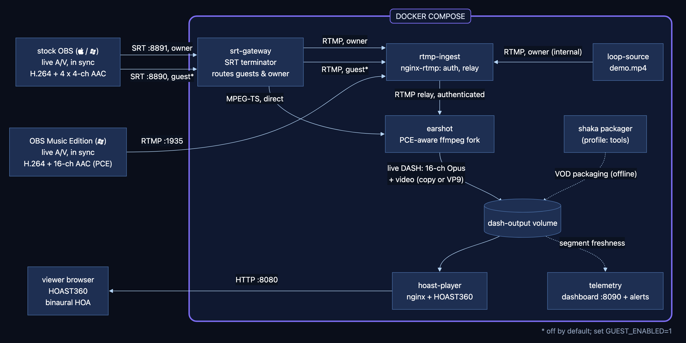
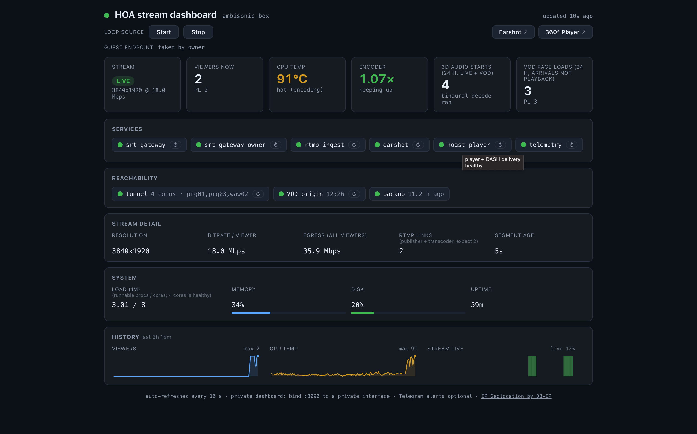
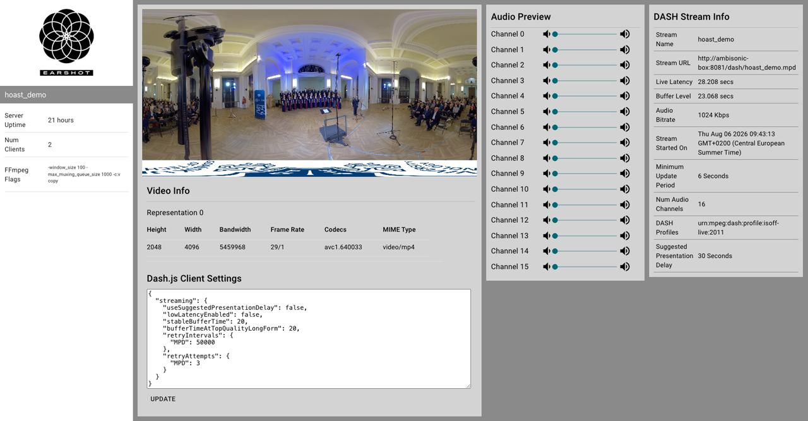
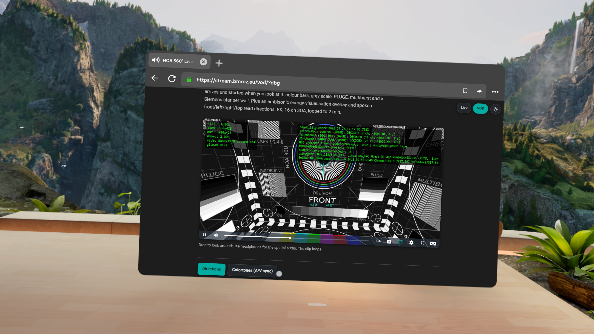

[](https://github.com/mormegil6/ambisonic-box/releases) [](docker-compose.yml) [](services/earshot/README.md) [](docs/ENDPOINTS.md) [](docs/AMBISONIC-ORDER.md) [](.env.example) [](https://stream.bmroz.eu/) [](LICENSE)

# ambisonic-box: live 360 video and third-order Ambisonics over MPEG-DASH

Containerised toolchain for live streaming 360 video with Higher-Order Ambisonics audio, 1st to 3rd order (3OA, 16ch is the canonical configuration): RTMP in, MPEG-DASH (multichannel Opus, WebM) out, rendered binaurally in the browser by a [patched HOAST360](https://github.com/mormegil6/hoast360) player that picks the ambisonic order up from the stream.

*Why "Ambisonic Box"? It ships as a Docker container (a box) - which was built and tested on a 2012 Mac Mini (a small box) and a Raspberry Pi 4 (a smaller box). Ambisonic audio, in a box, in a box, in a box. It's boxes all the way down.*

**Live demo:** <https://stream.bmroz.eu/> · **Project page:** <https://bmroz.eu/projects/360-livestream/>

## Quick start

```bash
git clone https://github.com/mormegil6/ambisonic-box.git && cd ambisonic-box
git submodule update --init
./scripts/setup.sh                      # writes .env + generates YOUR OWN publish key
cp /path/to/demo.mp4 content/demo.mp4   # H.264 + 16-ch AAC; see .env.example
docker compose up -d --build
# then open http://localhost:8080 in your browser
# (Earshot monitor: http://localhost:8081/webtools)
```

**On Windows, the setup line is `.\setup.cmd` instead** (or double-click `setup.cmd` in Explorer). Everything else is identical. The block below works the same in `cmd.exe` and in PowerShell, which is why its first line is split in two rather than joined with `&&`: `&&` is a cmd.exe thing, and Windows PowerShell 5.1, the one in the Start menu, rejects it.

```
git clone https://github.com/mormegil6/ambisonic-box.git
cd ambisonic-box
git submodule update --init
.\setup.cmd
docker compose up -d --build
```

Type the leading `.\`. cmd.exe would take a bare `setup` too, but PowerShell deliberately never runs a program out of the current directory, and `.\setup.cmd` is the one spelling both of them accept.

`setup.cmd` is a launcher, not a second implementation: it finds the bash that ships with Git for Windows and runs the same `scripts/setup.sh`. Do **not** substitute `bash scripts/setup.sh` on Windows. `bash` there is the WSL launcher in `System32`, not Git Bash, because Git's installer puts `cmd\` on PATH and not `bin\` - so that command reaches a different machine, or waits for a WSL distro that may not exist. If Git is installed somewhere unusual, `setup.cmd` also asks the registry and follows `git` on your PATH; failing everything it runs the same script inside a container, since you already need Docker.

`setup.sh` is what prints your ready-to-paste OBS URL with the passphrase already filled in, which is the main reason to run it rather than editing `.env` by hand. If you cannot run it at all, the stack needs only two values to start: copy `.env.example` to `.env` and set `RTMP_OWNER_KEY` and `LOOP_SOURCE_KEY` to any random strings of about 30 letters and digits. That skips the owner SRT route on UDP 8891; to get that too, also copy `docker-compose.override.yml.example` and set `SRT_OWNER_PASSPHRASE`.

**If `docker compose up` refuses with `required variable RTMP_OWNER_KEY is missing a value`,** setup has not run: there is no `.env`, or it has no value for that key. Run setup and try again. That check happens before anything is pulled, built or created, so there is nothing to clean up first.

**If instead it says `dependency failed to start: container ambi-box-rtmp-ingest-1 is unhealthy`,** run `docker compose logs rtmp-ingest`: compose reports that a dependency failed and swallows the reason. You reach this with an `.env` that exists but still carries one of the placeholder keys committed to this repository, which `rtmp-ingest` refuses to serve because port 1935 is published on all interfaces and both values are public. Re-running setup repairs an existing `.env` in place, without touching a key you chose yourself.

**On Windows, if setup itself fails with `set: -: invalid option` or `bash\r: No such file or directory`,** your clone predates the `.gitattributes` that pins line endings and the scripts are checked out with CRLF. Run `git add --renormalize .` and then `git checkout -- .` (two separate commands: `&&` is not valid in Windows PowerShell), or just clone again.

**What a working demo loop does and does not prove.** It exercises the whole delivery half - transcode, 16-channel Opus, DASH segmenting, the player, the binaural render - so if it plays, that half is sound. It exercises **none of the contribution half**, because loop-source publishes from inside the compose network with a token the stack gave itself. Your encoder, your channel layout, your network path and your credentials are all still untested at that point, and that is exactly where first-time setups actually fail. Treat a playing loop as "the box works", not as "my stream will work".

Without `content/demo.mp4` the stack still demos itself: on first start loop-source synthesises a spherical placeholder in-container (black sphere with a test-pattern screen at the front, and a 440 Hz source orbiting the listener in 3rd-order Ambisonics, so looking around audibly works). With `VOD_ENABLED=1` it also fetches the two `/vod/` reference masters from the pinned `vod-clips` release (~185 MB once, background, SHA-256 verified, fail-soft). Set `DEMO_CONTENT=0` to skip the synthesis, or replace `content/demo.mp4` with a real master any time (`docker compose restart loop-source` picks it up).

**"Am I livestreaming anything right now?"** A fair question to ask before `docker compose up`, and the honest answer has two halves.

**Nothing of yours is visible to anyone else.** The player, the operations dashboard and the earshot monitor all bind to `127.0.0.1` only, so nothing outside your own machine can watch, and the stack makes no outbound connection to publish anywhere. Making the demo public is a separate, deliberate act: a reverse proxy or a tunnel you set up yourself.

**Three ports do listen on all interfaces**, and it is better to know than to be reassured: `1935/tcp` (RTMP contribution), `8890/udp` (SRT), and `8891/udp` if you ran setup, which writes the owner route. Those are INBOUND - they exist so that you, or a guest you have deliberately enabled, can send a stream IN. Each one is gated: `rtmp-ingest` refuses to start at all while its keys are the placeholders committed here, the owner SRT route is useless without your passphrase, and the guest port admits nobody unless you set `GUEST_ENABLED=1`. They are reachable from your LAN, and from the internet only if you forward them yourself.

If you want certainty rather than reasoning, `docker compose down` stops everything.

## Requirements

- Docker Engine with the compose plugin (`docker compose`), buildx for multi-arch builds
- *On Windows:* Docker Desktop needs **WSL2** (`wsl --install`, then reboot) and **CPU virtualisation enabled in the BIOS/UEFI**, on Windows 11 as much as on 10. Docker Desktop's installer will tell you if either is missing, but not before you have downloaded it, and this caught the project's first outside tester
- ~2 GB of image builds on first `compose build` (earshot compiles its nginx-rtmp and ffmpeg fork from source)
- *Only for the test and measurement scripts:* host `ffmpeg`/`ffprobe`; Node.js (`npm ci`, then `npx playwright install chromium` for the two headless-browser scripts); `python3` + matplotlib for the trade-off plot

## Architecture

<div align="center">  </div>

<p align="center"><em>The data path only. Control and monitoring edges are deliberately omitted; <a href="docs/architecture/README.md">docs/architecture/</a> lists exactly what the diagram simplifies.</em></p>

<!-- Diagram source + generator: docs/architecture/ (edit architecture.mmd, run ./build.sh). -->

**What your encoder sends, and what the box does with it.** Whichever route you use, the stream arrives as H.264 video and AAC audio, because that is what OBS can send. Over RTMP the 16 audio channels have to arrive as a single AAC stream: RTMP is an old protocol and cannot carry the modern codecs this stack prefers. Over SRT they do not - OBS sends four separate 4-channel tracks - and from there the two SRT routes differ.

A **guest** stream, by default, has its four tracks combined into one 16-channel AAC stream and is handed on over RTMP to the same ingest the RTMP route uses. That extra step is deliberate: it is where guests are authorised, counted, time-limited and, if need be, cut off, so every one of those protections applies to SRT senders unchanged. Guests can take the direct route too (`GUEST_SRT_DIRECT=1`), which keeps all of those controls and drops only the re-encode, but it ships off: a guest is a stranger, so it stays something an operator turns on deliberately.

Your **own** stream (the `srt-gateway-owner` service, which `scripts/setup.sh` sets up for you) skips that step. Its four tracks are passed through untouched to earshot, which combines them and converts the audio to Opus in a single operation. The stream is therefore compressed once on the way in rather than twice, which sounds slightly better, and the box does about a third of the work it used to at 20 Mbps - the difference between a comfortable stream and an overheating one on modest hardware like a 2012 Mac Mini or a Raspberry Pi. You do not have to configure any of this; it is the default. `SRT_DIRECT=0` turns it off if you ever need the older behaviour.

From earshot onward the audio is always 16-channel Opus and is never downmixed: 3rd-order Ambisonics, ACN/SN3D, 16 channels end to end.

**Why 16 and not 25, and what would lift it.** ffmpeg's AAC encoder accepts only *named* channel layouts, so 4 (`quad`) and 16 (`hexadecagonal`) pass while 9 and 25 are refused outright. That is a limit on the AAC hop, not on delivery or rendering: the on-demand path never touches AAC and is **4th-order verified end to end** (a 25-channel clip auto-detected as order 4, rendered through the full order-4 impulse-response set). Live 4th order is therefore **theoretically reachable but untested**. Reaching it needs two independent things: a wider sender layout, which multitrack SRT already makes possible (25 channels would fit as five 5.1 tracks, each carrying five usable channels once the muted LFE slot is dropped), and a path that accepts a wider layout than the ones it has today. The owner route already stopped funnelling through 16-channel AAC over RTMP (that half shipped 2026-08-09); what pins the ceiling there now is that its direct listeners are fixed at 4x4 and 1x4, and guests take the AAC hop unless `GUEST_SRT_DIRECT=1`. The full argument, the two candidate routes past the ceiling, and the sender-side arithmetic beyond 3rd order are in [docs/AMBISONIC-ORDER.md](docs/AMBISONIC-ORDER.md).

**Video codec.** `docker-compose.yml`'s `FFMPEG_FLAGS` default is the single source of truth, and it is currently **H.264 passthrough** (`-c:v copy`) - so a clone with no `.env` streams passthrough, and video segments are `.m4s`/`.mp4` while audio stays Opus/WebM. VP9 (all-WebM) is the codec *policy* and ships as a ready-to-uncomment line in `.env.example`, not the running default: it fell below realtime at 4K on the reference deployment host (a 2012 Mac Mini, quad-core i7), so passthrough is what actually ships. Check what your own host will do rather than trusting this paragraph:

```bash
docker compose config | grep FFMPEG_FLAGS
```

`dash-output` in the diagram is a Docker volume: the shared filesystem earshot segments into and nginx serves from.

| Service | Role | Host port |
|---|---|---|
| `srt-gateway` | SRT contribution ingest for GUESTS (native OBS multitrack); joins 4x4 to 16-ch, republishes into the guest arbiter. Privilege-separated. The operator's own route runs a second instance, `srt-gateway-owner` on 8891/udp, written by `scripts/setup.sh`, which feeds earshot directly instead. See `SRT_ENABLED` / `GUEST_ENABLED` / `SRT_DIRECT` | 8890/udp |
| `rtmp-ingest` | RTMP contribution ingest (legacy route); stream-key auth, relay to earshot | 1935 |
| `earshot` | transcode to 16-ch Opus + video per `FFMPEG_FLAGS` (H.264 passthrough default, VP9 opt-in), live DASH segmenting ([vendored Envelop Earshot](services/earshot/README.md), patched) | 8081 (dev monitor) |
| `loop-source` | demo contribution encoder: loops `content/demo.mp4` | - |
| `hoast-player` | viewer origin: patched HOAST360 player + `/dash/` | 8080 |
| `telemetry` | ops dashboard + breakage-only alerts + curated public status.json ([telemetry/](telemetry/README.md)) | 8090 (bind private) |
| `shaka` | Shaka Packager, offline only, never in the live path. Main job: `scripts/package-vod-dash.sh` runs the image standalone to package the on-demand clips into `content/vod/dash/` (the compose `tools` profile additionally drives the optional A/V-sync variant packaging, `scripts/package-dash-variants.sh`) | - |

### What it looks like running

Two operator-facing views of the same running stream:

<div align="center">  </div>

<p align="center"><em>The custom telemetry dashboard on <code>:8090</code>: service health, reachability, stream detail, host load and three-hour history. Details in <a href="telemetry/README.md">telemetry/README.md</a>.</em></p>

<div align="center">  </div>

<p align="center"><em>Earshot's own built-in monitor on <code>:8081</code>, which is where the 16 individual audio channels and the live DASH representation details are actually visible.</em></p>

<div align="center">  </div>

<p align="center"><em>A Meta Quest 3 browser playing the stream at stream.bmroz.eu, with the <code>?dbg</code> capability probe reporting that 2-, 16- and 25-channel Opus all decoded on the headset itself. What that probe implies about ambisonic order is in <a href="docs/AMBISONIC-ORDER.md">docs/AMBISONIC-ORDER.md</a>.</em></p>

## Stream your own content

Two ways in, differing in transport. **SRT (Secure Reliable Transport) is the recommended one**: stock OBS, no patched fork, the same recipe on macOS and Windows, all 16 channels live. The older route is RTMP (Real-Time Messaging Protocol).

| | SRT (recommended) | RTMP (legacy) |
|---|---|---|
| Sender | stock OBS, macOS or Windows | OBS Studio Music Edition, Windows only |
| Audio | one 4-channel track (1st order) or four (3rd order); `srt-gateway` reads which and handles both | one 16-channel AAC track |
| Enabled | on by default (`SRT_ENABLED=0` unbinds the port) | always |

Both carry H.264 video with a keyframe interval that divides the segment duration (equality preferred: `-g 60` at 29.97/30 fps, `-g 50` at 25 fps, for the default 2 s segments; shorter intervals are valid but cost bitrate). Both land in the same place, and a guest arriving by either transport is held to the same session rules.

### Stock OBS over SRT

These settings are the same on macOS and Windows - only the audio routing differs, which is what the per-OS guides below cover.

Run `./scripts/setup.sh` first. It creates your `.env`, generates a publish key and a passphrase that are yours alone, switches on the SRT endpoint for your own broadcasts, and prints the URL below with your real passphrase already filled in.

That endpoint listens on every network interface, so pushing from a different machine needs nothing more than a UDP 8891 forward on your router, and your box's public address in place of the one below. Anyone without the passphrase is refused: SRT uses it as the connection's encryption key, so an unauthenticated caller never gets past the handshake. Both OBS guides cover restricting it further, and what leaving it open costs you.

(There is a second, separate endpoint for letting *other people* push to your box without a key. It is off by default and has its own rules: see [guest test endpoint](#guest-test-endpoint-the-guest-application).)

**Lost the URL setup.sh printed?** The values live in your `.env`. Read one at a time rather than opening the whole file, so a screen-share or terminal scroll-back does not expose the rest:

```sh
grep -m1 '^SRT_OWNER_PASSPHRASE=' .env | cut -d= -f2-   # the srt:// passphrase, for stock OBS
grep -m1 '^RTMP_OWNER_KEY='       .env | cut -d= -f2-   # the stream key, for OBS Music Edition over RTMP
docker compose exec srt-gateway-owner printenv SRT_OWNER_PASSPHRASE   # what the RUNNING container actually has
```

That last one is worth knowing: Compose reads `.env` when a container is *created*, so after editing a secret you need `docker compose up -d srt-gateway-owner` (recreate), not `restart`, or the file and the running process disagree.

`GUEST_GW_SECRET` is **not** a streaming credential and never goes into OBS - it authenticates the gateway containers to telemetry over the internal Docker network. The guest endpoint stays keyless whether or not it is set.

| Setting | Value |
|---|---|
| Settings > Audio > Channels | **`4.0`** |
| Settings > Output > Output Mode | **Advanced**, then the **Recording** tab |
| Type | **Custom Output (FFmpeg)** |
| FFmpeg Output Type | **Output to URL** |
| File path or URL | `srt://<box-address>:8891?streamid=owner&passphrase=<SRT_OWNER_PASSPHRASE>&latency=2000000&pkt_size=1128` - `127.0.0.1` if OBS runs on the box |
| Container Format | **mpegts** |
| Audio Encoder | plain **`aac`** - tick **"Show all codecs"** if hidden |
| Audio Track | tick **1, 2, 3, 4** |
| Muxer Settings | leave empty |
| Bitrates | audio 384 kbit/s per track, video against your uplink, see [docs/BITRATE.md](docs/BITRATE.md) |
| Start it with | **Start Recording** (not Start Streaming - see below) |

Custom Output (FFmpeg) is a **Recording**-tab output in OBS, even though it is streaming to a URL, so **Start Recording** is the button that pushes. Nothing appears under Start Streaming.

**Per-OS routing, step by step:** creating the four 4-channel sources above is the one OS-specific step, so this is where the shared setup ends and your platform's guide takes over.

- **[docs/obs-macos.md](docs/obs-macos.md)** - a multichannel Core Audio device ([BlackHole](https://github.com/ExistentialAudio/BlackHole))
- **[docs/obs-windows.md](docs/obs-windows.md)** - ASIO, via [REAPER](https://www.reaper.fm/)'s ReaRoute and the [atkAudio plugin](https://obsproject.com/forum/resources/atkaudio-plugin.2099/)

Feed those four tracks from four 4-channel sources - device channels 1-4, 5-8, 9-12, 13-16, downmixing off - assigned one per track in Advanced Audio Properties. The join is strictly positional (track 1 becomes channels 1-4, and so on, never a downmix), so AmbiX order survives end to end.

**Channel counts, sender side:** 4 channels (1st order) and 16 (3rd order) pass through as they are; a 2nd-order source must be zero-padded to 16 channels by the sender (a valid 3rd-order signal with silent upper orders), and a plain stereo or mono push produces no output at all - on the guest endpoint it is auto-ended with that reason. 4th order is a sender-side possibility too (see [Architecture](#architecture) above), but nothing downstream accepts it yet, so 4 and 16 are what actually work today.

Four of those values are exact rather than indicative. Each was established by pushing a per-channel tone ladder through real hardware and reading back what arrived, because each obvious-looking alternative fails **without any error**:

- **`4.0`, never `7.1`** - OBS's 7.1 path mutes the LFE slot outright, which for ambisonics erases ACN 3, the X axis.
- **plain `aac`, never `mp2` or `aac_at`** - `mp2` is the container default and refuses more than 2 channels; `aac_at` (CoreAudio, macOS) scrambles channel order within every track.
- **`latency` is in MICROSECONDS** - 2 s is `2000000`, not `2000`.
- **`pkt_size=1128` through a tunnel** - SRT's default packet is about 1316 bytes and a WireGuard or Tailscale tunnel carries a 1280-byte MTU, so every packet fragments; under load a large share of the fragments never reassemble and the picture arrives shredded while SRT still reports the link up. Harmless on an ordinary 1500-byte path, essential on a tunnelled one.

#### Bitrate

Audio is paid once on the uplink, so the contribution rule is generous: 96 kbit/s per channel, which is where the 384 kbit/s for four tracks in the recipes above comes from. Video is the opposite trade, paid per viewer, and this deployment's 6.5 Mbit/s at 4096x2048 is a deliberate egress choice rather than a quality recommendation. The published anchors behind both, and the honest caveat that no transparency measurement exists for AAC-coded ambisonics, are in [docs/BITRATE.md](docs/BITRATE.md).

### Legacy: RTMP

RTMP carries exactly one audio track, so 16 channels over it need [OBS Studio Music Edition](https://github.com/pkviet/obs-studio/releases/), a Windows-only patched fork. It stays fully supported - the demo loop uses this path - but new setups should start with SRT above.

These are the settings for your OWN stream (the `owner` application, authenticated by your key). Guests use a different application, covered under [Guest test endpoint](#guest-test-endpoint-the-guest-application).

| Setting | Value |
|---|---|
| Server | `rtmp://<host>:1935/owner` |
| Stream key | your `RTMP_OWNER_KEY` (the one `scripts/setup.sh` generated into `.env`) |
| Audio | 16 channels, AAC, AmbiX (ACN/SN3D) channel order |

The stream appears at `http://<host>:8080/dash/<DASH_NAME>.mpd` (default `hoast_demo`), which is exactly what the bundled player page requests. The manifest name is `DASH_NAME`, independent of `RTMP_OWNER_KEY`: a custom stream key does not move the manifest URL, so you can rotate the key without editing the player. A custom `DASH_NAME` needs no player edit either: the page asks telemetry (`/api/live`) which manifest the box is writing and falls back to `hoast_demo.mpd` only when telemetry is absent.

The demo loop publishes over this same `owner` application under its own separate `LOOP_SOURCE_KEY`, never over the public internet - see Configuration below.

## Guest test endpoint (the `guest` application)

Anyone with an ambisonic microphone rig and OBS can test their stream against this stack without standing up their own server: a keyless application that borrows the whole pipeline for the duration of a session.

> **UNDER CONSTRUCTION on the public demo at [stream.bmroz.eu](https://stream.bmroz.eu/).** The endpoint is fully implemented and works today over a LAN or a VPN, but it is **not yet reachable from the public internet on the reference deployment**: guests are the only thing that needs an inbound port opened, and that request is still with university IT administration. Nothing else is affected, because the player egresses through an outbound tunnel and the operator's own contribution path rides the VPN. If you are running your own instance this does not apply to you: open the port on your own host and the endpoint is reachable immediately.
>
> **What has and has not been proven, stated plainly.** The full session lifecycle is exercised on every push by an automated suite and, since 2026-08-10, on a Raspberry Pi 4: admission, the single slot, the session cap, cooldown, the reconnect grace, bans, the kick lever, fail-closed behaviour with the arbiter down, and sanitising of the one string a guest controls. A real guest session has been carried end to end from a **third-party machine** over plain IP - admitted, taking the direct-to-DASH path, with all sixteen channels arriving in the right order at the right levels - and guest handover measures 0.1 s on amd64 and 1.0 s worst case on arm64 against a 4 s budget.
> What has NOT happened: **no unknown person has ever used this endpoint, and it has never been exposed to the public internet.** Everything above ran on a LAN or a VPN, on machines and networks we control. That is a different thing from surviving strangers, and it stays written here until the port lands and someone we did not brief pushes to it.

**Disabled by default.** Most deployments are a single private publisher and should never expose a keyless application; set `GUEST_ENABLED=1` to opt in. Off, the `guest` application does not exist in the ingest config and the status pages carry no trace of it.

| Setting | Value |
|---|---|
| Server (SRT, recommended) | `srt://<host>:8890?streamid=<name>&latency=2000000&pkt_size=1128` |
| Server (RTMP) | `rtmp://<host>:1935/guest` |
| Stream key / streamid | anything you like (it names your session in the status pages) |
| Audio / video | same requirements as the `owner` application [above](#stream-your-own-content) |

The four rules that decide whether a session works:

- **One publisher at a time, first come first served.** A second concurrent push is rejected outright, not queued.
- **Reconnect grace** of `GUEST_GRACE_S` (default 120 s): reconnect inside it and the session continues, **from the same IP address**. The slot stays locked to the original caller for the whole window, so a different address is refused rather than allowed to inherit the session's remaining time. An encoder reconnecting normally keeps its address (only the source port changes), so this is invisible in practice; it matters if you switch networks mid-session, which reads as a new guest and has to wait for the grace to lapse.
- **Session cap** of `GUEST_MAX_S` (default 3 h), then a `GUEST_COOLDOWN_S` cooldown (default 300 s) after any forced end, so an auto-reconnecting encoder cannot re-claim the slot instantly.
- **Optional resource guard** (`GUEST_MAX_TEMP_C`, `GUEST_MAX_MBPS`, both off by default): temperature is the one to trust, bitrate is a coarse pre-filter. Set both from a measurement of your own host.

**Network prerequisite:** the RTMP guest endpoint is exactly as public as TCP port 1935; the SRT endpoint (if enabled) is exactly as public as UDP 8890. If your host sits behind a firewall or NAT, the one thing to arrange is inbound access to whichever port(s) you use; everything else ships in this compose file.

Everything else - bans, reporting, the privacy notice, the session log and its retention, owner preemption, stalled-transcode auto-end, fail-closed behaviour, and the separate `SRT_MODE=owner` route for the operator's own SRT pushes - is in [docs/GUEST-ENDPOINT.md](docs/GUEST-ENDPOINT.md).

## On-demand VOD clips

**Off by default:** the stack's purpose is live streaming, VOD is opt-in. Set `VOD_ENABLED=1` to serve the on-demand page at `/vod/`; disabled, the `/vod/` and `/vod-dash/` routes return 404.

Two reference clips are published: `directions` (a 360 orientation test, spoken direction reads panned in third-order Ambisonics under an energy-visualisation overlay that shows where each read is supposed to come from, so a listener can hear whether the delivered audio still agrees with the picture) and `colortones` (a colour-and-tone A/V-sync pattern). No media is committed here - the masters, the 8K test card and the caption sidecars ship as [release assets](https://github.com/mormegil6/ambisonic-box/releases/tag/vod-clips), and only the generators and the player wiring are tracked.

Generation, packaging, the 360 test card and its projection check, captions, headset playback and serving VOD from object storage: [docs/VOD.md](docs/VOD.md).

<div align="center">  </div>

<p align="center"><em>One frame of the <code>directions</code> reference clip. The glow was rendered from the ambisonic stem before encoding and is baked into the picture, so it cannot move: together with the wall label it is a fixed reference for where the sound is supposed to be. What is under test is the audio. Here the word being spoken is <em>right</em>, so it should be heard from the right; if it arrives from anywhere else, the delivery chain has scrambled the channels while the picture stayed put.</em></p>

## Configuration

| Variable | Default | Purpose |
|---|---|---|
| `RTMP_OWNER_KEY` | none; **`scripts/setup.sh` generates one** | The real, security-relevant publish secret at rtmp-ingest: stream name or `?token=` must match. Also gates the SRT owner route's relay into `owner`. The placeholder that ships in `.env.example` is committed to a public repository, so **rtmp-ingest refuses to start while it is still in place** rather than coming up reachable on `:1935` with a key anyone can read. This is the only credential treated that way |
| `ALLOW_DEFAULT_OWNER_KEY` | `0` | Start anyway with the placeholder owner key, warning on every boot. For a host where `:1935` reaches nobody (offline demo, laptop on no network). Never set it on anything reachable |
| `LOOP_SOURCE_KEY` | `hoast_demo` | Publish auth for loop-source only. Checked the same way as `RTMP_OWNER_KEY` but never crosses the public internet (loop-source publishes over the docker-internal network); safe to leave at the default |
| `DASH_NAME` | `hoast_demo` | Public DASH manifest filename served at `/dash/<DASH_NAME>.mpd`. Fixed and validated (`[A-Za-z0-9_-]+`) at earshot; decoupled from `RTMP_OWNER_KEY`/`LOOP_SOURCE_KEY` so either key is rotatable. The player discovers the manifest via telemetry (`/api/live`) and only falls back to the literal `hoast_demo.mpd` without it |
| `FFMPEG_FLAGS` | the `docker-compose.yml` fallback (single source of truth) | Video policy of the earshot transcode; audio is always 16-ch Opus. Check the effective value with `docker compose config \| grep FFMPEG_FLAGS`; a VP9 opt-in line ships commented in `.env.example` |
| `DEMO_CONTENT` | `1` | Self-provisioning demo at loop-source start: synthesise the spherical placeholder when `content/demo.mp4` is missing, fetch the VOD masters from the pinned release when absent (~185 MB once, SHA-256-verified, fail-soft). `0` = neither; see Quick start |
| `VOD_ENABLED` | `0` | On-demand VOD page + packaged clips, off by default: the stack's purpose is live streaming, VOD is opt-in. `0` serves no VOD route and suppresses the reference-master fetch even with `DEMO_CONTENT=1`; the packaging scripts stay in the repo, inert until run |
| `SRT_ENABLED` | `1` | SRT contribution ingest (`srt-gateway`), the recommended path. On by default; it still admits nobody unless `GUEST_ENABLED=1`. `0` leaves UDP 8890 unbound |
| `GUEST_ENABLED` | `0` | Keyless guest test endpoint, off by default; see the Guest test endpoint section. Timing knobs (`GUEST_GRACE_S`, `GUEST_MAX_S`, `GUEST_COOLDOWN_S`, `GUEST_RETENTION_DAYS`, `GUEST_BAN_DAYS`) and the resource guard (`GUEST_MAX_TEMP_C`, `GUEST_MAX_MBPS`, `GUEST_LIMIT_STRIKES`) are documented in `.env.example` |
| `SRT_MODE` | `guest` | What `srt-gateway` does with a caller: `guest` republishes into the arbitrated `guest` application; `owner` hands the stream to earshot directly by default (see `SRT_DIRECT`), or republishes into the token-authed `owner` application with `RTMP_OWNER_KEY` when `SRT_DIRECT=0`; either way it bypasses guest arbitration. Not set by the shipped compose file; `scripts/setup.sh` writes an `srt-gateway-owner` service into `docker-compose.override.yml` that sets it, and the same block ships commented in `docker-compose.override.yml.example`. Owner mode refuses to start without `SRT_OWNER_PASSPHRASE` and `RTMP_OWNER_KEY`, the key being required even though the direct route never uses it, so that `SRT_DIRECT=0` stays a working fallback. This is how you push your own 16 channels from stock OBS with `GUEST_ENABLED=0`. See [docs/GUEST-ENDPOINT.md](docs/GUEST-ENDPOINT.md#the-owner-srt-route-srt_modeowner) |
| `SRT_DIRECT` | `1` | Owner route only: hand the SRT stream to earshot as a bare MPEG-TS remux instead of re-encoding it to 16-channel AAC and republishing over RTMP. Deletes one lossy audio generation and most of the gateway's CPU (~28-42 % of a core at 20 Mbps against ~90-130 %). `0` restores the RTMP republish, which is what to use if you want the owner's stream in rtmp-ingest's stat page or are bisecting a fault across the two routes. Does not affect guests; they have their own switch, below. Written into the override by `scripts/setup.sh`; on an existing install edit the override's `SRT_DIRECT` line or set it in `.env` if that line reads `${SRT_DIRECT:-1}` |
| `GUEST_SRT_DIRECT` | `0` | The same direct-to-DASH route for **guests**, off by default because a guest is an untrusted stranger and this is the newer path. Turning it on keeps every admission control (auth, slot, kick, ban, session cap): those hang off telemetry's session protocol, which the direct route also speaks, not off the RTMP hop. It drops only the AAC re-encode and its CPU cost. Needs `GUEST_GW_SECRET` set, and `SRT_DIRECT_LISTENERS=1` on earshot, or the session claim succeeds and the dial then hits a port nothing is listening on. No guest session has yet run on this route |
| `SRT_OWNER_MAX_S` | `86400` | Owner-mode session ceiling (24 h), ending a session on purpose before the MPEG-TS 33-bit timestamp wrap at ~26.5 h, whose behaviour through either chain is unverified. Reconnect continues. `0` disables; guest mode never reads it |
| `ENABLE_NONFREE` | `0` | earshot ffmpeg licence stamp: the stack builds WITHOUT `--enable-nonfree` so images are redistributable; `1` restores the stock upstream configure line (`services/earshot/README.md` section 7) |

`scripts/setup.sh` creates `.env` from `.env.example`; edit it to change any of these.

Two things are deliberately *not* env-tunable: the audio policy (16-ch Opus, hardcoded upstream in Earshot) and the live-edge distance. The earshot image build patches ffmpeg's DASH muxer to floor `suggestedPresentationDelay` at 30 s (`DASH_SPD_FLOOR` build arg), so players join ~30 s behind the live edge by design. That is the price of gap-free playback of a 16-channel live stream.

## Test and measurement scripts

| Script | Purpose |
|---|---|
| `scripts/test-pipeline.sh` | synthetic end-to-end test: 16 sine channels + test video pushed through ingest auth, asserts live 16-ch Opus DASH appears with the video codec the effective `FFMPEG_FLAGS` implies; also guards that README, `.env.example` and the compose fallback agree. PASS/FAIL |
| `scripts/make-lipsync-scene.sh` | cut a GOP-matched, tv-range transient excerpt for by-ear lip-sync judging |
| `scripts/package-dash-variants.sh` | package a WebM master into 0.5/1/2/4 s DASH variants for the comparison page (`lip-sync-test/index.html`) |
| `scripts/measure-lipsync.js` | headless-Chromium A/V measurement over the packaged variants |
| `scripts/plot-segment-tradeoff.py` | regenerate the segment-duration trade-off figure |
| `scripts/smoke-hoast360.js` | headless-browser smoke test of the patched player |

`package-dash-variants.sh` drives Shaka Packager through the compose `tools` profile. The pattern for manual runs is `docker compose run --rm shaka <packager args>`.

## Troubleshooting

| Symptom | Cause | Fix |
|---|---|---|
| Relay `Connection refused` after recreating earshot | rtmp-ingest resolves earshot's address once, at startup | `docker compose restart rtmp-ingest` |
| Segments longer than `-seg_duration` (e.g. 3.34 s) | GOP duration does not divide the segment target, so no keyframe lands on the boundary and the muxer closes at the next one (`-g 50` at 29.97 fps is a 1.668 s GOP, so the first keyframe at or after 2 s falls at 3.336 s) | set `-g` so the segment duration is an integer multiple of the GOP (`-g 60` @ 29.97/30, `-g 50` @ 25); equality is the preferred default for the live encode |
| Browser loops `PIPELINE_ERROR_DECODE` | full-range (pc) VP9 source breaks the dash.js/MSE path | re-encode to limited range: `-vf scale=in_range=pc:out_range=tv -color_range tv` |
| `loop-source` idle although `demo.mp4` exists | file presence is checked once at startup | `docker compose restart loop-source` |
| Publisher dies seconds into a 4K push | RTMP message limit smaller than 4K keyframes | keep `max_message 10M` in the nginx-rtmp configs (already set here) |

## Working directories: `output/` and `scratch/`

Two gitignored directories at the repo root, with opposite guarantees.

`output/` is **earshot's** working directory: the DASH volume is bind-backed by it, and earshot's entrypoint clears that directory on every container start so each run begins a fresh timeline. Anything you leave in `output/` is deleted by the next `docker compose up`. That is intended for segments, and a trap for everything else.

`scratch/` is mounted alongside at `/opt/data/scratch` and is never touched by earshot, which only ever clears `.../dash`. Put anything that has to survive a restart here: test harnesses, probe captures written from inside the container, one-off files. Because it sits inside the repo, Node also resolves the root `node_modules` from it, so browser-based harnesses run without extra path setup.

## Deployment

| Host | Status |
|---|---|
| Local / lab (AMD64) | the [quick start](#quick-start) above; validated on WSL2 Ubuntu 24.04 LTS and on Ubuntu Server 26.04 LTS, the reference deployment host |
| Raspberry Pi 4 (ARM64) | **validated end to end** on Raspberry Pi OS 13 (trixie), 64-bit, over the RTMP/loop path: real 16-channel Opus DASH from a real publish, and 20 minutes of sustained transcoding at 32-34 % CPU and 54.5-65.7 C with no throttling. Re-measured 2026-08-10 on Debian 13: a cold native build is 19m38s (earshot alone 14m56s), a four-core compile peaks at 71.0 C with the official case fan cycling against its 70 C trip, and `throttled=0x0` across all 198 samples with the clock held at 1500 MHz. Guest handover there is 0.5 s median, 1.0 s worst, against a 4 s budget. **Not measured on arm64:** sustained 4K transcode load as opposed to compile load, and concurrent-viewer capacity |
| Azure | planned, not yet validated; the constraint is raw L4 ingress for the contribution leg (UDP 8890/8891 for SRT, TCP 1935 for RTMP), which HTTP-only front ends cannot carry |

Per-host settings (a private bind for the dashboard, host metric mounts, Telegram tokens, branding) go in `docker-compose.override.yml`, which Compose loads automatically and which is gitignored. `scripts/setup.sh` writes one containing the owner SRT route; [docker-compose.override.yml.example](docker-compose.override.yml.example) documents the rest, block by block, to copy from as needed. The base stack runs without any of it.

Measurements, the two arm64 build traps this repo already fixes, and what belongs in an override: [docs/DEPLOYMENT.md](docs/DEPLOYMENT.md).

## Documentation

- Measurement notes: some measured results behind this README (transcode thermals, the bitrate and temperature ladder, codec constraints, AV1 viability) are being written up for publication and are not in the repo; this README will carry the citation and the tagged commit once the papers are out. Studies that are finished and justify a decision the stack actually made do ship here: the segment-duration study in [lip-sync-test/RESULTS.md](lip-sync-test/RESULTS.md) and the A/V-sync instruments in [tests/av-sync/README.md](tests/av-sync/README.md), both listed below.
- [docs/AMBISONIC-ORDER.md](docs/AMBISONIC-ORDER.md): why the live path stops at 16 channels, what is already 4th-order verified, and the two routes past the AAC ceiling
- [docs/BITRATE.md](docs/BITRATE.md): contribution bitrate, audio and video, with the published anchors
- [docs/GUEST-ENDPOINT.md](docs/GUEST-ENDPOINT.md): the guest session rules in full, and the `SRT_MODE=owner` route
- [docs/VOD.md](docs/VOD.md): on-demand clips, the 360 test card, captions, headset playback, object-storage delivery
- [docs/obs-macos.md](docs/obs-macos.md) / [docs/obs-windows.md](docs/obs-windows.md): the per-OS sender recipes, step by step
- [docs/ENDPOINTS.md](docs/ENDPOINTS.md): every port/endpoint the stack exposes, public vs private, and what to monitor
- [docs/DEPLOYMENT.md](docs/DEPLOYMENT.md): where the stack has run, what was measured on each host, and what belongs in a per-host override
- [telemetry/README.md](telemetry/README.md): monitoring service (dashboard + alerts + public status.json)
- [docs/CI.md](docs/CI.md): the four CI workflows, why each check exists, and what they deliberately do not cover
- [services/earshot/README.md](services/earshot/README.md): Earshot vendoring provenance and local patches
- [lip-sync-test/RESULTS.md](lip-sync-test/RESULTS.md): the segment-duration study - measured across 0.5/1/2/4 s variants. Segment duration turns out **not** to affect A/V sync (a structural 0 ms offset at every duration); it is a bitrate and buffer-depth trade-off, which is why 2 s is the default
- [tests/av-sync/README.md](tests/av-sync/README.md): the browser-console instruments built during the A/V-desync investigation, and how to run them against the colour+tone clip
- [docs/fixtures/README.md](docs/fixtures/README.md): the two fixtures that reproduce the exact setups the OBS guides were verified with
- [docs/architecture/README.md](docs/architecture/README.md): the source for the data-flow diagram at the top of this README, and how to regenerate it
- [.env.example](.env.example): configuration reference, including how to prepare `content/demo.mp4`

## License

Compose files, service configs and scripts in this repository: **Apache 2.0**. The published media is licensed separately, and everything bundled or built keeps its own license:

| Component | License |
|---|---|
| **Reference clips and media** shipped as [release assets](https://github.com/mormegil6/ambisonic-box/releases/tag/vod-clips): the `directions` and `colortones` clips, the 8K 360 test card, and the caption sidecars | **[CC BY 4.0](https://creativecommons.org/licenses/by/4.0/)** - reuse, remix and redistribute freely, including commercially, with attribution (one disclosed exception in [docs/VOD.md](docs/VOD.md#licence)) |
| [HOAST360](https://github.com/mormegil6/hoast360) (patched fork, git submodule) | GPL-3.0-or-later |
| [Envelop Earshot](https://github.com/EnvelopSound/Earshot) (vendored in `services/earshot/src`, four documented local patches) | GPL |
| Envelop/pkviet FFmpeg fork (built inside the earshot image) | GPL v3 (built with `--enable-gpl`; the default build (`ENABLE_NONFREE=0`) is redistributable, and only an explicit `ENABLE_NONFREE=1` build carries the non-redistributable `--enable-nonfree` stamp (services/earshot/README.md section 7)) |
| [nginx-rtmp-module](https://github.com/arut/nginx-rtmp-module) | BSD-2-Clause |
| [Shaka Packager](https://github.com/shaka-project/shaka-packager) (official image) | BSD-3-Clause |
| nginx, Alpine packages | BSD-2-Clause / various |

## Citation

This repository is the containerised successor of the toolchain described in the paper below. If you use this work in research, please cite it:

```bibtex
@inproceedings{mroz2023toolchain,
  title     = {A Commonly-Accessible Toolchain for Live Streaming Music Events
               with Higher-Order Ambisonic Audio and 4K 360 Vision},
  author    = {Mr{\'o}z, Bart{\l}omiej and Odya, Piotr and Danowski,
               Przemys{\l}aw and Kabaci{\'n}ski, Marek},
  booktitle = {Proceedings of the AES International Conference on Spatial and
               Immersive Audio},
  publisher = {Audio Engineering Society},
  month     = aug,
  year      = {2023},
  url       = {https://www.aes.org/e-lib/browse.cfm?elib=22204}
}
```

## Acknowledgments

- Thomas Deppisch and Nils Meyer-Kahlen, [HOAST360](https://github.com/thomasdeppisch/hoast360), the higher-order Ambisonics 360 player this project patches and serves
- [Envelop](https://envelop.us), Earshot, the multichannel RTMP-to-DASH transcoder
- The [OBS Project](https://obsproject.com/), OBS Studio - the recommended sender needs no fork at all
- pkviet, [OBS Studio Music Edition](https://github.com/pkviet/obs-studio) and the PCE-capable FFmpeg fork, which carried the 16-channel RTMP path before that
- Existential Audio, [BlackHole](https://github.com/ExistentialAudio/BlackHole), the macOS multichannel loopback driver the macOS recipe routes through
- atkAudio, [its OBS plugin](https://obsproject.com/forum/resources/atkaudio-plugin.2099/), which is what gets ASIO into OBS on Windows
- [Shaka project](https://github.com/shaka-project), Shaka Packager
- [AmbisonicEnergyRenderer](https://github.com/mormegil6/AmbisonicEnergyRenderer), which renders the directional-energy overlay in the `directions` clip from the raw ACN/SN3D signal (spherical-harmonic decode onto a t-design, k-NN inverse-distance gridding, streamed straight into ffmpeg)
- Gdańsk University of Technology, [Department of Multimedia Systems](https://multimed.org/index_en.html)

## Contact

Bartłomiej Mróz · bartlomiej.mroz@pg.edu.pl · Department of Multimedia Systems, Gdańsk University of Technology · [bmroz.eu](https://bmroz.eu)
