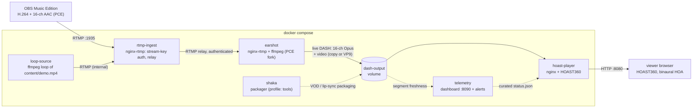

     [](https://bmroz.eu/projects/360-livestream/) [](LICENSE)

# hoa-360-stream: live 360 video and third-order Ambisonics over MPEG-DASH

Containerised toolchain for live streaming 360 video with third-order
Ambisonics (16-channel) audio: RTMP in, MPEG-DASH (VP9 + Opus, WebM) out,
rendered binaurally in the browser by a patched [HOAST360](https://github.com/mormegil6/hoast360) player.

**Live demo:** <https://bmroz.eu/projects/360-livestream/>

## Architecture



The RTMP contribution leg is H.264 + 16-channel AAC by protocol necessity
(legacy RTMP/FLV cannot carry VP9/Opus). Everything from the earshot
transcode onward is VP9 + 16-ch Opus in WebM. Audio is never downmixed:
3rd-order Ambisonics, ACN/SN3D, 16 channels end to end.

| Service | Role | Host port |
|---|---|---|
| `rtmp-ingest` | public RTMP ingest; stream-key auth, relay to earshot | 1935 |
| `earshot` | transcode to 16-ch Opus + VP9, live DASH segmenting ([vendored Envelop Earshot](services/earshot/README.md), patched) | 8081 (dev monitor) |
| `loop-source` | demo contribution encoder: loops `content/demo.mp4` | - |
| `hoast-player` | viewer origin: patched HOAST360 player + `/dash/` | 8080 |
| `telemetry` | ops dashboard + breakage-only alerts + curated public status.json ([telemetry/](telemetry/README.md)) | 8090 (bind private) |
| `shaka` | Shaka Packager for VOD / lip-sync packaging; compose profile `tools`, manual runs only | - |

## Requirements

- Docker Engine with the compose plugin (`docker compose`), buildx for
  multi-arch builds
- ~2 GB of image builds on first `compose build` (earshot compiles its
  nginx-rtmp and ffmpeg fork from source)
- Only for the test and measurement scripts: host `ffmpeg`/`ffprobe`;
  Node.js (`npm ci`, then `npx playwright install chromium` for the two
  headless-browser scripts); `python3` + matplotlib for the trade-off plot

## Quick start

```bash
git clone https://git.pg.edu.pl/p829296/hoa-360-stream.git && cd hoa-360-stream
git submodule update --init
cp /path/to/demo.mp4 content/demo.mp4   # H.264 + 16-ch AAC; see .env.example
docker compose up -d --build
# then open http://localhost:8080 in your browser
# (Earshot monitor: http://localhost:8081/webtools)
```

Without `content/demo.mp4` the stack still runs and you can push to it live
(next section). `loop-source` checks for the file once at startup. If you
add `demo.mp4` later, run `docker compose restart loop-source`.

## Stream your own content

Use [OBS Studio Music Edition](https://github.com/pkviet/obs-studio/releases/)
(supports 16.0 AAC):

| Setting | Value |
|---|---|
| Server | `rtmp://<host>:1935/live` |
| Stream key | `hoast_demo` (or your `STREAM_KEY`) |
| Audio | 16 channels, AAC, AmbiX (ACN/SN3D) channel order |
| Video | H.264, keyframe interval that divides the segment duration (equality preferred: `-g 60` at 29.97/30 fps, `-g 50` at 25 fps, for the default 2 s segments; shorter intervals are valid but cost bitrate) |

The stream appears at `http://<host>:8080/dash/<DASH_NAME>.mpd` (default
`hoast_demo`), which is exactly what the bundled player page requests. The
manifest name is `DASH_NAME`, independent of `STREAM_KEY`: a custom stream key
no longer moves the manifest URL, so you can rotate the key without editing the
player. Only edit `services/hoast-player/index.html` if you set a custom
`DASH_NAME`.

## Configuration

| Variable | Default | Purpose |
|---|---|---|
| `STREAM_KEY` | `hoast_demo` | Publish auth at rtmp-ingest: stream name or `?token=` must match |
| `DASH_NAME` | `hoast_demo` | Public DASH manifest filename served at `/dash/<DASH_NAME>.mpd`. Fixed and validated (`[A-Za-z0-9_-]+`) at earshot; decoupled from `STREAM_KEY` so the key is rotatable. Must match the name hardcoded in `services/hoast-player/index.html` |
| `FFMPEG_FLAGS` | VP9 realtime, 2 s segments | Video policy of the earshot transcode; audio is always 16-ch Opus. `-c:v copy` fallback documented in `.env.example` |

Copy `.env.example` to `.env` to override either.

Two things are deliberately *not* env-tunable: the audio policy (16-ch Opus,
hardcoded upstream in Earshot) and the live-edge distance. The earshot image
build patches ffmpeg's DASH muxer to floor `suggestedPresentationDelay` at
30 s (`DASH_SPD_FLOOR` build arg), so players join ~30 s behind the live edge
by design. That is the price of gap-free playback of a 16-channel live stream.

## Measurements: DASH segment duration

Does segment duration affect lip sync? Measured answer: **no**. The A/V
start offset is structurally 0 ms across 0.5/1/2/4 s variants (audio
stream-copied, video GOP the only variable; details in
[lip-sync-test/RESULTS.md](lip-sync-test/RESULTS.md)). Segment duration is
instead a bitrate/latency trade-off:


0.5 s segments force a keyframe every 15 frames and push realtime VP9 ~6×
past its bitrate target (with visible stalls); 4 s segments halve the
time-shift granularity for no gain. **2 s is the default** (`-g 60
-seg_duration 2` at 29.97/30 fps).

## Test and measurement scripts

| Script | Purpose |
|---|---|
| `scripts/test-pipeline.sh` | synthetic end-to-end test: 16 sine channels + test video pushed through ingest auth, asserts live 16-ch Opus/VP9 DASH appears; PASS/FAIL |
| `scripts/make-lipsync-scene.sh` | cut a GOP-matched, tv-range transient excerpt for by-ear lip-sync judging |
| `scripts/package-dash-variants.sh` | package a WebM master into 0.5/1/2/4 s DASH variants for the comparison page (`lip-sync-test/index.html`) |
| `scripts/measure-lipsync.js` | headless-Chromium A/V measurement over the packaged variants |
| `scripts/plot-segment-tradeoff.py` | regenerate the segment-duration trade-off figure |
| `scripts/smoke-hoast360.js` | headless-browser smoke test of the patched player |

`package-dash-variants.sh` drives Shaka Packager through the compose `tools`
profile. The pattern for manual runs is `docker compose run --rm shaka
<packager args>`.

## Troubleshooting

| Symptom | Cause | Fix |
|---|---|---|
| Relay `Connection refused` after recreating earshot | rtmp-ingest resolves earshot's address once, at startup | `docker compose restart rtmp-ingest` |
| Segments longer than `-seg_duration` (e.g. 3.34 s) | GOP duration does not divide the segment target, so no keyframe lands on the boundary and the muxer closes at the next one (`-g 50` at 29.97 fps is a 1.668 s GOP, so the first keyframe at or after 2 s falls at 3.336 s) | set `-g` so the segment duration is an integer multiple of the GOP (`-g 60` @ 29.97/30, `-g 50` @ 25); equality is the preferred default for the live encode |
| Browser loops `PIPELINE_ERROR_DECODE` | full-range (pc) VP9 source breaks the dash.js/MSE path | re-encode to limited range: `-vf scale=in_range=pc:out_range=tv -color_range tv` |
| `loop-source` idle although `demo.mp4` exists | file presence is checked once at startup | `docker compose restart loop-source` |
| Publisher dies seconds into a 4K push | RTMP message limit smaller than 4K keyframes | keep `max_message 10M` in the nginx-rtmp configs (already set here) |

## Deployment

**Local / lab (AMD64):** the quick start above. Validated on WSL2 Ubuntu and
Ubuntu Server 22.04.

**Azure Container Apps:** build and push images (`docker buildx build
--platform linux/amd64`), mount `dash-output` as ephemeral storage, expose
8080 (player) and 1935 (ingest, TCP). For events, point OBS at the ingress
and keep `FFMPEG_FLAGS` at the VP9 default.

**Raspberry Pi 5 (ARM64, experimental):** all base images are multi-arch and
earshot builds from source, so `docker buildx build --platform linux/arm64`
works; realtime VP9 encoding is the bottleneck. If the Pi cannot keep up, set
`FFMPEG_FLAGS` to the `-c:v copy` fallback (video segments become MP4,
audio stays Opus/WebM), or use a bigger machine; the Pi target is a
nice-to-have, not a requirement.

**Per-host overrides:** deployment-specific settings (bind the telemetry
dashboard to a private/Tailscale IP, mount host CPU-temp/disk for the telemetry
service, Telegram tokens, a branded landing page) go in
`docker-compose.override.yml`, which Compose loads automatically and which is
gitignored. Copy [docker-compose.override.yml.example](docker-compose.override.yml.example)
and adjust. The base stack runs without it.

## Documentation

- [docs/PAPER-NOTES.md](docs/PAPER-NOTES.md): measured results from the live path (transcode thermals, codec constraints, 360 complexity, AV1 viability)
- [docs/ENDPOINTS.md](docs/ENDPOINTS.md): every port/endpoint the stack exposes, public vs private, and what to monitor
- [telemetry/README.md](telemetry/README.md): monitoring service (dashboard + alerts + public status.json)
- [services/earshot/README.md](services/earshot/README.md): Earshot vendoring provenance and local patches
- [lip-sync-test/RESULTS.md](lip-sync-test/RESULTS.md): full segment-duration / lip-sync study
- [docs/NDI.md](docs/NDI.md): Quest 3 / Twinkle NDI output extension (design only)
- [docs/NDI-TEST.md](docs/NDI-TEST.md): hands-on NDI/Twinkle validation runbook
- [.env.example](.env.example): configuration reference, including how to prepare `content/demo.mp4`

## License

Compose files, service configs and scripts in this repository: **Apache 2.0**.
Bundled and built components keep their own licenses:

| Component | License |
|---|---|
| [HOAST360](https://github.com/mormegil6/hoast360) (patched fork, git submodule) | GPL-3.0-or-later |
| [Envelop Earshot](https://github.com/EnvelopSound/Earshot) (vendored in `services/earshot/src`, three documented patches) | GPL |
| Envelop/pkviet FFmpeg fork (built inside the earshot image) | GPL v3 (built with `--enable-gpl --enable-nonfree`; treat the built earshot image as non-redistributable and build it yourself) |
| [nginx-rtmp-module](https://github.com/arut/nginx-rtmp-module) | BSD-2-Clause |
| [Shaka Packager](https://github.com/shaka-project/shaka-packager) (official image) | BSD-3-Clause |
| nginx, Alpine packages | BSD-2-Clause / various |

## Citation

This repository is the containerised successor of the toolchain described in
the paper below. If you use this work in research, please cite it:

```bibtex
@inproceedings{mroz2023toolchain,
  title     = {A Commonly-Accessible Toolchain for Live Streaming Music Events
               with Higher-Order Ambisonic Audio and 4K 360 Vision},
  author    = {Mr{\'o}z, Bart{\l}omiej and Odya, Piotr and Danowski,
               Przemys{\l}aw and Kabaci{\'n}ski, Marek},
  booktitle = {Proceedings of the AES International Conference on Spatial and
               Immersive Audio},
  publisher = {Audio Engineering Society},
  month     = aug,
  year      = {2023},
  url       = {https://www.aes.org/e-lib/browse.cfm?elib=22204}
}
```

## Acknowledgments

- Thomas Deppisch and Nils Meyer-Kahlen, [HOAST360](https://github.com/thomasdeppisch/hoast360),
  the higher-order Ambisonics 360 player this project patches and serves
- [Envelop](https://envelop.us), Earshot, the multichannel RTMP-to-DASH transcoder
- pkviet, OBS Studio Music Edition and the PCE-capable FFmpeg fork
- [Shaka project](https://github.com/shaka-project), Shaka Packager
- Gdańsk University of Technology, Department of Multimedia Systems

## Contact

Bartłomiej Mróz · bartlomiej.mroz@pg.edu.pl · Department of Multimedia Systems, Gdańsk University of Technology · [bmroz.eu](https://bmroz.eu)
