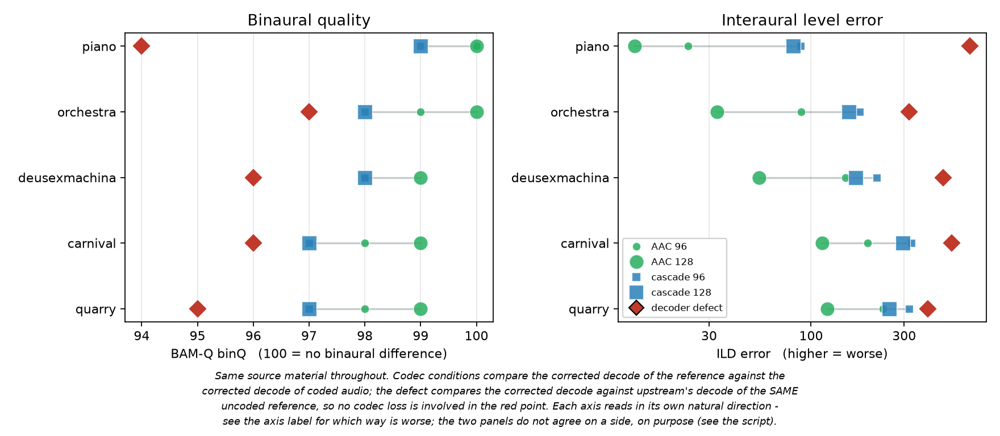

# AAC contribution bitrate on 16-channel ambisonics: measurement results

**Date:** 2026-08-15 · **Host:** MacBook (arm64, macOS), encoding inside `ambi-box-earshot:local` · **Encoder:** ffmpeg 4.3 native AAC (the contribution leg's actual encoder - a host ffmpeg 9.0 cannot do 16-channel AAC at all, see Limits) · **Metric:** [AMBIQUAL](https://github.com/QxLabIreland/Ambiqual) · **Material:** five excerpts (30 s each) from the [HOA seven-year corpus](https://doi.org/10.34808/w8bx-2094), the same five items as [opus-compression-test/RESULTS.md](../opus-compression-test/RESULTS.md)

## The question

[docs/BITRATE.md](../docs/BITRATE.md) sets contribution audio at 96 kbit/s per channel and says so plainly: the figure is a convention borrowed from elsewhere - AAC-LC's classic ~64/channel, EBU Tech 3324's 448-for-5.1 (~75/channel), YouTube's 256-for-4-channel ambisonics (64/channel) - none of it measured on higher-order ambisonics, and the doc calls it "a well-covered convention rather than a proven threshold".

So: where does measurable degradation actually begin on this material, and where does 96 sit relative to it?

**What this cannot answer.** This is an objective metric, not a listening test: it says where the models detect degradation, nothing more. Read it as bounding the question, not closing it.

## Method

1. Same five excerpts as the Opus study, recovered from this project's own session transcripts since that study's work directory was gitignored and is gone (details in the private plan log). Two would have been wrong on the obvious guess: `piano` is Grainger's *Bridal Lullaby*, not the corpus's more prominent Chopin recording, and `quarry`'s second take is marked not-for-publication and genuinely absent from the corpus, leaving its first take as the only choice rather than a default that happened to be right.
2. Each excerpt AAC-encoded at six per-channel rates - 32, 48, 64, 96, 128, 160 kbit/s - with **only bitrate varying**, `channelmap=channel_layout=hexadecagonal` forced so the encoder accepts 16 channels.
3. **Two chains measured per excerpt per rate:**
   - **aac** - the contribution leg alone: uncompressed reference in, AAC out, decoded back to PCM.
   - **cascade** - what a viewer actually receives: the AAC output decoded, then re-encoded to Opus at the production setting (`-mapping_family 255 -b:a 1536k`), since earshot always re-encodes. If this curve flattens earlier than the AAC-alone curve, contribution bitrate stops mattering above that point because Opus is the binding constraint.
4. AMBIQUAL run with the **uncompressed excerpt as reference** in every case, never one encode against another - same discipline as the Opus study.

Harness: [`scripts/measure-aac-bitrate.sh`](../scripts/measure-aac-bitrate.sh). All encoding runs inside the earshot image, not on the host - a host ffmpeg 9.0 refuses 16-channel AAC entirely (see Limits).

## Results

*Regenerate with `python3 scripts/plot-aac-bitrate.py 2026-08`.*

| kbit/s/channel | carnival | deusexmachina | orchestra | piano | quarry |
|---|---|---|---|---|---|
| 32 | 0.566 | 0.546 | 0.571 | 0.690 | 0.546 |
| 48 | 0.689 | 0.660 | 0.696 | 0.780 | 0.641 |
| 64 | 0.768 | 0.735 | 0.789 | 0.848 | 0.734 |
| 96 | 0.896 | 0.850 | 0.906 | 0.941 | 0.847 |
| 128 | 0.947 | 0.915 | 0.962 | 0.972 | 0.904 |
| 160 | 0.929 | 0.965 | 0.907 | 0.925 | 0.974 |

AAC-alone AMBIQUAL LQ per excerpt. Full table, both chains, both metrics: [results.tsv](results.tsv).

**The cascade flattens; the contribution leg does not, not yet.** From 64 to 128 kbit/s/channel, AAC-alone LQ rises by 0.12-0.18 across the five excerpts; the cascade rises by only 0.08-0.11 over the same span - AAC-alone gains 1.6 to 1.96x faster than what a viewer actually receives. That is the Opus re-encode acting as a ceiling: past a point, spending more contribution bitrate buys quality the downstream Opus encode cannot pass through.

**96 sits close to where that ceiling starts to bind, not below it.** At 96, the aac-cascade gap is already 0.08-0.11 LQ across every excerpt - the two curves have visibly separated by production's own operating point (see the figure). Contribution bitrate is not underspent: pushing past 96 keeps improving the AAC-alone number but buys the cascade comparatively little.

**Localisation is punished far more than quality at low bitrate**, the same shape the Opus study found. At 32 kbit/s/channel, LA sits at 32-43% of LQ across the five excerpts; by 160 that ratio has risen to 73-84%. The ambisonic-specific failure mode AMBIQUAL exists to catch is exactly what a plain quality metric would miss here.

**One thing this study cannot explain, stated rather than smoothed over.** Three of five excerpts (piano, orchestra, carnival) show LQ *lower* at 160 than at 128, in both chains, by 0.02-0.05. The other two (deusexmachina, quarry) keep rising cleanly through 160. The two chains are not independent evidence here - cascade's input *is* the AAC output for that item, so a dip in one is expected to appear in the other; this is one effect observed twice, not two confirmations. Five excerpts, one window each, no repeats: the same limitation the Opus study carries, and not enough to distinguish real high-bitrate encoder behaviour from AMBIQUAL noise on this material. Read the 128-160 range as "no further measurable gain," not as "160 is worse than 128."

## Second opinion: BAM-Q

AMBIQUAL works in the ambisonic domain. To ask a genuinely independent question, the same conditions were also scored with **BAM-Q + GPSMq** ([Fleßner et al. 2019](https://doi.org/10.1109/TASLP.2019.2925620)), a different model family that works on **binaural** signals and was validated against listening tests. That needs a binaural render, so every condition was decoded through **HOAST360's own decoder** - the real `HOASTloader` and `HOASTBinDecoder`, the shipped IRs, the same convolver topology - making the renderer a controlled constant and keeping the measurement about the chain that actually ships. Harness: [`scripts/binauralize.js`](../scripts/binauralize.js), [`scripts/run_bamq.m`](../scripts/run_bamq.m); full output in [bamq.tsv](bamq.tsv).

Mean across the five excerpts. `OPM_fix` is the monaural measure, `binQ` the binaural one (100 = no binaural difference), `overall` the combined figure:

| condition | overall | OPM_fix | binQ |
|---|---|---|---|
| AAC 128 | 0.5906 | 73.96 | 99.4 |
| AAC 96 | 0.5742 | 71.21 | 98.6 |
| cascade 128 | 0.5721 | 70.91 | 97.8 |
| cascade 96 | 0.5617 | 69.22 | 97.8 |

**BAM-Q agrees with AMBIQUAL that the cascade flattens.** Monaural quality improves from 96 to 128 kbit/s/channel on all five excerpts for AAC alone (+1.06 to +5.52 OPM), while the cascade gains less and on one excerpt (`deusexmachina`) goes slightly negative. Two metric families, different domains, different validation lineages, same conclusion - which is worth more than either result alone.

**The degradation AAC causes is almost entirely monaural.** `binQ` sits at 97-100 for every codec condition, meaning bitrate reduction leaves interaural cues substantially intact while damaging spectral quality. That is the monaural/binaural split Fleßner et al. describe, and it is the reason to pair a binaural metric with an ambisonic one rather than run two of the same kind. It also matches AMBIQUAL's own LQ-versus-LA gap from the ambisonic side.

### A decoder defect had to be fixed before any of this was measurable

Building the binaural render surfaced a bug in HOAST360's filter loading, upstream since 2020: `HoastLoader.concatBuffers()` read source channel 0 for **every** destination channel in a higher-order group, so each group was filled with copies of its first channel's decoding filter. At 3rd order that is **10 of the 12 higher-order filter channels wrong**; only ambisonic 5 and 13 were correct, being first in their groups, and 1-4 were never affected (they come from the first-order buffer, handled separately).

It is fixed here, and the fix is what every binaural number above was measured through. Measuring the codec through a broken decode would have confounded a bitrate question with a decoder defect.

*Regenerate with `python3 scripts/plot-bamq.py 2026-08`.*

**The defect cost more than any codec setting tested.** Its mean `overall` is 0.5408 against 0.5617 for the worst codec condition, its `OPM_fix` 65.89 against 69.22, its `binQ` 95.6 against 97.8. On every individual excerpt its `binQ` is below the worst codec condition and its ILD error is 2x to 7x larger (piano: 649.9 against 88.2). And it costs that with **no compression involved at all** - those figures compare an uncoded reference decoded two ways.

## Limits, stated plainly

- Five excerpts, one window each, one metric, no listening test, no repeats. The 160 dip above is the visible cost of that design; a wider corpus or repeated windows would settle it.
- **Objective only.** Neither AMBIQUAL nor BAM-Q can establish transparency, which is a subjective ABX threshold; BAM-Q is validated *against* listening tests, it does not replace one. Two agreeing objective metrics raise confidence in the shape of the curve, not in any claim about audibility.
- **The BAM-Q arm carries the renderer with it.** Its numbers describe the material as decoded by HOAST360's own binaural chain. That is deliberate, since it is what a listener receives, but it means those figures are conditional on that renderer in a way the AMBIQUAL figures are not.
- Measured on arm64 macOS, encoding inside the earshot container so the encoder matches production; CPU-cost scaling to the Pi 4 was not measured here (that question is answered for Opus in the sibling study, not for AAC contribution, which is upstream of any host this project runs).
- **A host ffmpeg cannot run this study at all.** ffmpeg 9.0 here refuses `-ac 16` (resolves to layout `9.1.6`, rejected) and refuses `hexadecagonal` named explicitly too. Earshot's pinned 4.3-era fork encodes it cleanly. The 16-channel ceiling in [docs/AMBISONIC-ORDER.md](../docs/AMBISONIC-ORDER.md) is therefore version-dependent as well as layout-dependent - reproducing this on a modern host ffmpeg would measure nothing, not merely hit the documented cap.
- **AMBIQUAL needs sample-exact length equality** between reference and degraded audio or it throws on the internal broadcast. AAC/Opus decode does not naturally land there; two time-based fixes (`apad -t N`, `apad=whole_dur=N`) both failed silently on this ffmpeg build. The harness uses `atrim=end_sample=N` and verifies the resulting frame count, retrying up to three times - even the exact command was observed to occasionally overshoot by one frame under concurrent load. See the harness header for the full account.
