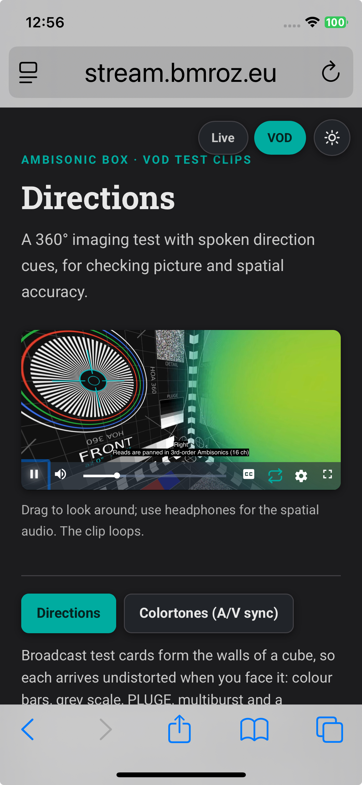
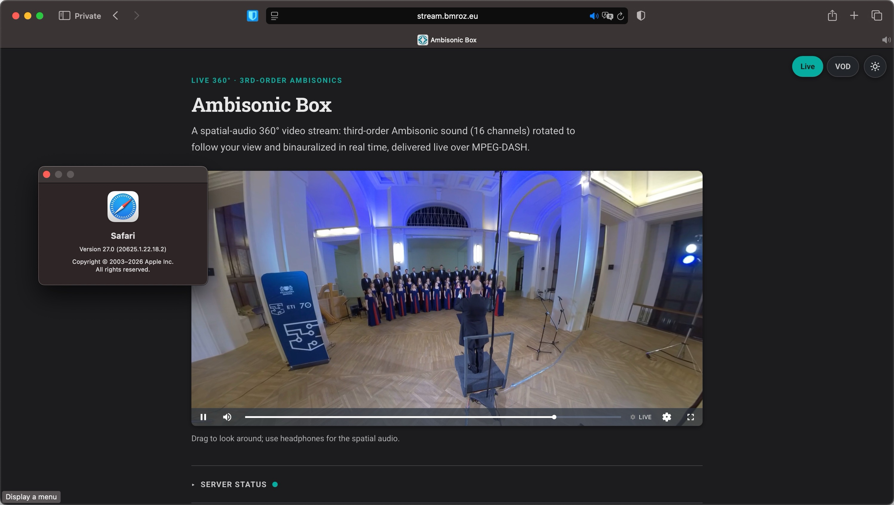

# Safari and iOS: playing 16-channel Ambisonics without a native decoder

**It works.** Third-order Ambisonics, 16 channels, plays on an iPhone and on macOS Safari from the same DASH stream every other client receives: video, spatial audio, head tracking, fullscreen. No iOS-specific variant, no server-side downmix, no extra lossy generation.

<table>
  <tr>
    <td valign="center"></td>
    <td valign="center"></td>
  </tr>
</table>

Every route Safari offers for decoding audio, `decodeAudioData`, WebCodecs `AudioDecoder`, and MPEG-DASH via MediaSource, refuses this stream's 16-channel Opus, on both macOS and iOS. The stream plays there anyway, by decoding the audio in WebAssembly and scheduling it against the video clock. Unlike the Chrome field trial in [docs/CHROME-MULTICHANNEL-OPUS.md](CHROME-MULTICHANNEL-OPUS.md), this is not a regression with a fix in flight. It is measured as a structural gap in WebKit's audio pipeline, and nothing found while measuring it points at an upcoming change.

**Try it yourself, on a Mac, iPhone, or headset:** <https://stream.bmroz.eu/iphone-test/>. Three short pages, each runs itself and ends with a six-character ID; results also beacon back automatically. Real tester runs on both macOS Safari and iPhone Safari (iOS 26.6) are behind the numbers below.

## What is broken, measured

| | Chrome / Firefox / Brave | Safari (macOS 27) | Safari (iOS 26.6) |
|---|---|---|---|
| `decodeAudioData`, 16-ch Opus | works | fails | fails |
| `decodeAudioData`, 2-ch Opus | works | works in WebM AND in MP4 | works in WebM, fails in MP4 |
| WebCodecs `AudioDecoder`, 16-ch Opus | works | `isConfigSupported` false | `isConfigSupported` false |
| MSE, `audio/mp4; codecs="opus"` | works | not supported | not supported (`MediaSource` itself is absent; only `ManagedMediaSource` exists) |
| `decodeAudioData`, 4-ch and 8-ch AAC | works | works, channels distinct | works, channels distinct, in AAC's own order rather than the file's (4.0 arrives as C, L, R, Cs; 7.1 with the LFE last), measured 2026-09-01 on iOS 18.7 with a tone ladder per channel |
| `decodeAudioData`, 16-ch AAC | n/a | not tested; CoreAudio has no layout tag for it (see below) | n/a |

Read that table one row at a time rather than as a verdict on a codec. Safari's four decode surfaces disagree with each other, measured directly: in Safari 27, `MediaSource.isTypeSupported('audio/mp4; codecs="opus"')` returns false while `decodeAudioData` decodes the same stereo Opus-in-MP4 file, and `canPlayType` returns the empty string for it. Measure the surface the code actually uses, and on the platform that will run it: macOS Safari 27 decodes stereo Opus-in-MP4 through `decodeAudioData` while iOS 18.7 refuses the same file, so the two are not interchangeable as evidence. Both agree that `MediaSource.isTypeSupported` returns false for `audio/mp4; codecs="opus"` and that `canPlayType` returns the empty string.

The AAC ceiling here is Apple's, not WebKit's, and it is not a browser bug to file. `afinfo` and `afconvert` refuse a 16-channel AAC file outside any browser, `CoreAudioBaseTypes.h` defines no AAC channel layout tag above 8, and Apple's own encoder fails at 9 channels and up. Read that as a ceiling on Apple platforms, not on the format and not on ffmpeg: the contribution leg produces 16-channel AAC with a PCE every day, and Apple simply has no layout tag able to describe it. No ffmpeg change touches this one, including the master fix in [docs/AMBISONIC-ORDER.md](AMBISONIC-ORDER.md). Even `kAudioChannelLayoutTag_HOA_ACN_SN3D` gives no route through AAC. Treat 8 channels as a permanent ceiling for planning: 1st order (4 channels) has a fully native AAC path on Safari, 3rd order has none.

A Meta Quest 3's own Chromium-based browser decodes this stream, 16 and 25 channels, with no fallback needed at all; see the capability shot in the main [README](../README.md) and [docs/AMBISONIC-ORDER.md](AMBISONIC-ORDER.md).

## What works instead, measured on real hardware

**Chosen: WASM decode of the stream this stack already serves.** [`opus-decoder`](https://github.com/eshaz/wasm-audio-decoders), built from source rather than its published bundle, which [silently discarded its own multichannel options](https://github.com/eshaz/wasm-audio-decoders/issues/129) when minified. That defect was fixed upstream in [opus-decoder 0.7.12](https://github.com/eshaz/wasm-audio-decoders/releases), released 2026-08-27, which excludes the constructor properties from minification. The published bundle is therefore usable again and the source build can be dropped; doing so needs its own verification that all 16 channels still arrive in ACN order, and has not been done here. One stateful decoder fed the live DASH segments directly:

| | macOS Safari 27 | iPhone Safari (iOS 26.6) |
|---|---|---|
| Channels, order | 16, correct ACN order | 16, correct ACN order |
| Speed | 47-67x realtime across five runs | 35-88x realtime across two devices, iOS 18.7 and 26.6 |
| Continuity across segment boundaries | gapless (junction metric 1.5, i.e. continuous) | gapless (junction metric 1.5) |
| Server changes needed | none | none |

Web Audio itself is not a constraint: a 16-channel graph routes correctly on the iPhone, while `AudioContext.destination` reports `maxChannelCount` 2. The probe verifies this by giving every channel its own frequency, a 100 Hz staircase from 200 Hz on channel 0 to 1700 Hz on channel 15 ([`scripts/check-tones.py`](../scripts/check-tones.py) reads the same ladder back from a rendered file), and reading them back, so a channel arriving in the wrong position returns the wrong tone. Channel 13 returned its 1500 Hz and channel 6 its 800 Hz. Sixteen channels in, binaural stereo out, is exactly the shape the player needs.

**Fallback, also proven, weaker on iOS specifically: four parallel 4-channel AAC streams**, decoded natively (no WASM). AAC's LFE element low-passes full-band content, which rules out two 8-channel streams; four 4.0-layout streams (no LFE) is what survives that constraint. An 8-channel 7.1 file gives a second reason: it decodes, but arrives with its channels permuted. The four 4-channel streams also arrive permuted relative to fetch order, so a decoder has to read the order rather than assume it.

| | macOS Safari 27 | iPhone Safari (iOS 26.6) |
|---|---|---|
| Per-chunk `decodeAudioData` | works, discontinuous at each 2s boundary | works, discontinuous (junction metric 42-62) |
| Stateful WebCodecs decode (the gapless path) | works | fails: `InternalAudioDecoderCocoa decoding failed` |

So the fallback is fully viable on macOS and loses its gapless half specifically on iOS, which is why the WASM route is the primary choice rather than a mild preference.

The iPhone columns come from three probe runs: a capability probe, a WASM multistream decode of this deployment's own DASH segments, and the 4x4 AAC fallback through both of its decode paths. Each page beacons its full report to `hoast-player`'s access log, keyed by that id, so the figures here can be rechecked from the server side without the tester repeating anything.

**Settled:** `AudioWorkletNode` is available on iOS Safari, which matters because a continuous WASM decode loop needs a low-latency path into Web Audio and this project does not use the deprecated `ScriptProcessorNode`. Two iPhone probes reported it absent, the first by a bare `typeof` and the second by the rebuilt check that actually constructs a worklet (a `typeof`-only check had already produced one false conclusion in this same investigation, in the opus-decoder bundle above). Both were served over plain HTTP. `AudioWorklet` is gated on a secure context, so on an insecure origin `ctx.audioWorklet` is undefined and the rebuilt check fails with `undefined is not an object (evaluating 'wctx.audioWorklet.addModule')`, which is indistinguishable from the platform not shipping it; the macOS run that contradicted them passed on `localhost`, which counts as secure. Re-run over HTTPS, the same check constructs and connects a worklet. The HTTPS run came from a second phone on iOS 18.7 rather than the 26.6 one that failed, so scheme and OS version changed together and this is not a single-variable comparison. The secure-context gate accounts for the failure exactly, and every other result on the older phone matched the 26.6 runs, so the older OS reads as coverage rather than as an alternative explanation. The probe now records `isSecureContext` and `location.protocol`, so a future run cannot leave this ambiguous.

## Keeping the audio alive when the window is not visible

Moving the Safari window to another macOS Space stopped the audio within about two seconds, and it took one to two seconds to resume on return. YouTube and the dash.js reference player are unaffected in the same browser, which made it look like a defect in this player, and it was, though not in the way either obvious theory predicted. The AudioContext never suspended and no timer starved. The `<video>` element itself paused, three seconds before `document.hidden` even flipped, and the audio is slaved to that element's clock.

WebKit suspends a backgrounded video element unless it has a decodable audio track AND is unmuted. A three-way control page settled it, three trials each:

| element | while hidden |
|---|---|
| muted, no audio track (this player's element) | suspends immediately |
| unmuted, no audio track | suspends immediately |
| unmuted, silent AAC track | keeps decoding |

Two consequences. Unmuting alone is not enough, so this cannot be fixed with a one-line property change. And the policy is per-element, not per-page: the surviving element was in the same document as the two that died, so the familiar trick of parking a silent `<audio>` on the page does nothing here.

The fix is a silent stereo AAC AdaptationSet in the manifest, at 8 kbit/s, which the element plays while the feed carries the real 16-channel audio. It has to be AAC: Safari's MSE reports no support for Opus-in-MP4, and that is the surface dash.js asks. On the VP9/WebM path Opus-in-WebM is supported by both MSE and ManagedMediaSource and would serve instead. Unmuting is gated on a real user gesture, because WebKit pauses an unmuted element that did not start from one, which breaks muted autoplay outright.

It costs a constant 0.37 s later start, measured: an element carrying an audio track begins that much later than one without. Constant offset, not drift, so sync is unaffected.

## How it plays on iPhone

Third-order Ambisonics plays on an iPhone from the same DASH stream every other client receives, screenshots at the top of this document. There is no iOS-specific variant, no server-side downmix and no extra lossy generation. Verified on an iPhone Xs (A12, iOS 18.7) on 2026-08-29: video, 16-channel spatial audio, head tracking, fullscreen and looping, on the on-demand clips.

**Live audio on iPhone works.** Two intermittent failures were also measured there on 2026-08-29. Whether the first also occurs on the on-demand clips has not been tested; the second does, confirmed 2026-08-31:

- **The media session tears down mid-session, and it is a MediaSource detach.** The element fires `abort` then `emptied` and is left at `readyState` 0, paused, with an empty buffer, indefinitely. Eight of eleven instrumented captures end in exactly `MANAGED_MEDIA_SOURCE_END_STREAMING`, then `el:abort`, then `el:emptied`. That triple was reproduced on macOS Safari 27 on 2026-09-01 by doing what dash.js's own `VideoModel.setSource(null)` does, `element.removeAttribute('src'); element.load()`: WebKit's `prepareForLoad()` calls `detachMediaSource()` unconditionally, which for a ManagedMediaSource is `elementDetached()` then `setStreaming(false)`, so the source goes to `closed` and emits `endstreaming` with an empty buffer, and because the `src` attribute was removed first nothing reopens it. `abort` then `emptied` is the media element load algorithm's own signature, which is what rules out the backgrounding explanation this note carried earlier: a suspended element keeps its buffer, and all of these captures show `buffered.length` 0. Three of the eight name a lead-in: `CONFORMANCE_VIOLATION`, `ADAPTATION_SET_REMOVED_NO_CAPABILITIES` (`CapabilitiesFilter` dropping the 16-channel Opus set, which Safari cannot decode: `isTypeSupported('audio/mp4; codecs="opus"')` is false on macOS Safari 27 and on iOS), `BASE_URLS_UPDATED`, `STREAM_UPDATED`, then the detach. The other five show no such lead-in, so that chain is one route in and not the only one. Two earlier readings recorded here are superseded: dash.js's silent decode-error retry (refuted, `PLAYBACK_ERROR` occurs zero times across the corpus and `STREAM_DEACTIVATED` only ever at page load) and WebKit's backgrounding policy (refuted by the element signature above). The same detach also explains the zero-request failure below, so the two are one defect reached at different moments. What triggers the detach on iOS is not identified; the mechanism is. This player's watchdog now recovers a torn-down session in place, re-attaching the source and resuming rather than reloading the page: measured end-to-end on macOS Safari 27 against the live stream, playback is back under a second after the watchdog's second 15-second tick, and the full page reload remains the fallback if the re-attach does not take. The check runs even while the tab is hidden; a fully backgrounded tab had earlier been measured sitting dead for over 10 minutes because the check never ran there. On-phone confirmation of the in-place path is pending.
- **A Safari tab can lose all audio output while every API reports success.** Measured directly on 2026-08-29: `AudioContext.state` stays `running`, its clock keeps advancing, an `AnalyserNode` on the output confirms real samples, a plain `<audio>` element plays a short clip to completion with no error, and a brand-new `AudioContext` created afterward is equally silent, yet nothing is audible. The state survived closing the original context and reloading the page, and cleared only when Safari itself was quit. No signal reaches the page that distinguishes this from a healthy session, so it cannot be detected or worked around here; see "What still costs something" below. It is not specific to the live player: on 2026-08-31 it also reproduced on the on-demand clip page, which shares no manifest, no packaging pipeline and no live-manifest handling with the live path, confirming the fault tracks the tab rather than any one page's code. Filed as [WebKit bug 323104](https://bugs.webkit.org/show_bug.cgi?id=323104) on 2026-09-01, with a self-contained test page (an oscillator, a plain audio element, a second context, no player code) that reproduced the readings inside an affected tab three times: reached with the back button, whether restored from the back-forward cache or created anew, the page is silent; a second tab plays; typing the page's address into the bar gives a page that plays.

The two live-specific mechanisms once suspected, the patched `endstreaming` gate and the feed's 3.5 s anchor threshold, are ruled out: repeated live sessions on 2026-08-29 reached full feed state and audible output well past both, then lost sound later in the same session with no corresponding change in feed state.

A live stream also has no duration, so the loop and end-of-clip handling described below do not apply to it, and the live manifest still carries no keep-alive track.

Four platform requirements have to be met together, and missing any one of them produces a player that looks correct and does not work.

**The media engine.** iOS ships `ManagedMediaSource` and no `MediaSource`. WebKit activates it only for an element whose remote playback is disabled, so `disableRemotePlayback` is set before the source is attached. dash.js 4.7.4 additionally treats the `endstreaming` hint as a permanent stop, which blocks even the init segment and leaves the player with zero segment requests; the fork patches that to honour the hint only once a quality is initialised and the buffer is non-empty.

**The video codec.** No iPhone before the A17 Pro decodes AV1, and dash.js removes an AdaptationSet whose codec the device cannot handle, so an AV1-only manifest leaves those devices with no video track at all. The clips carry a second H.264 ladder for them, capped at 3840x1920 where phone decoders cap. See [VOD.md](VOD.md).

**The audio session.** The video element is muted, because the audible signal comes from Web Audio rather than from the element, and iOS then classifies the page as ambient sound: the output follows the ringer switch and a phone on silent plays nothing, while every state the page can see reports healthy. Setting `navigator.audioSession.type = 'playback'` declares it as media playback instead. The context is also closed on `pagehide`, which is hygiene, not a fix. A note here once read this close as preventing the platform fault described above, by staying under WebKit's per-process context limit. That reading did not survive measurement: a silent process still creates new realtime contexts without error, and the silence still occurs with the close in place.

**The gestures.** `DeviceOrientationEvent.requestPermission()` is granted only from inside a handler for a real user interaction, so it is requested from the touch that starts playback rather than from the `play` event, which fires later on the engine's own schedule. `playsinline` is required as well, or `play()` hands over to the system fullscreen player, which shows the raw equirectangular frame and never paints the WebGL canvas.

Fullscreen is a CSS one. Safari on iPhone offers fullscreen only for a video element, never for an arbitrary element, so `requestFullscreen` on the player falls back to the element's own native fullscreen. That hands playback to the system player, which draws the video frame directly and never composites the WebGL canvas: the sphere disappears and the viewer is left looking at the raw equirectangular projection, a flat, bowed image with the ceiling and floor smeared across the top and bottom edges. Dragging no longer rotates anything, because the surface that responded to it is gone. Expanding the player container with CSS keeps the canvas, the projection and the controls, at the cost of the browser chrome staying on screen.

## What still costs something

- Audio arrives 1.3 to 2.7 seconds after playback starts, measured across runs. The feed will not anchor until it holds 3.5 s of contiguous decoded content, so the wait is the time to fetch two audio segments. Fetching them during page load rather than after the first tap would remove it.
- A looping clip loses about 0.4 s of audio at the wrap. The opening segments are pre-fetched during the run-out, which reduced it from 4.4 s; closing it entirely means holding decoded content across the discontinuity.
- An A12 sustains the 4K H.264 rung but has little margin at it, alongside a WebGL sphere, 16 convolvers and a WASM decoder. A device that raises a decode error is kept below that rung for the rest of the session, and an explicit choice from the quality menu overrides that.
- Audio on iPhone, live or on-demand, can go silent mid-session with no observable cause and no player-side recovery, because the fault sits below every API the page can query; quitting Safari clears it, and so does typing an address into that tab's address bar, while reloads and back/forward navigations do not ([WebKit bug 323104](https://bugs.webkit.org/show_bug.cgi?id=323104)). See [the note above the requirements](#live-failure-note).
- A media session can tear down mid-session when its MediaSource is detached, which on a ManagedMediaSource closes it permanently; the player's watchdog now re-attaches the source in place within about 30 seconds, hidden or not, with a page reload as the fallback. Not fixed at the source yet; the upstream report and fix are prepared. See [the note above the requirements](#live-failure-note).
- The live path still emits no keep-alive track, so backgrounding behaviour is proven on static fixtures only. See below.

## Testing this

Headless WebKit is not a proxy for Safari here. Playwright's WebKit did not reproduce the ManagedMediaSource request block, the scheduler stall that killed the tab at a fixed point, or the loss of audio at a loop wrap; all three were found on real hardware. Treat it as evidence about WebKit's parser and codecs, not about its media session, its process limits or its event ordering.

Real Safari on macOS can be driven directly through `safaridriver`, which reproduces the engine-level behaviour but not the device-level limits. Anything touching audio sessions, gesture policy or memory needs a phone.

## What the industry does, and what it declined to do

Worth recording, because the workarounds here look improvised until you see the prior art.

Facebook's browser delivery for its 8-channel TBE format was a 10-channel Opus track using **channel mapping family 255**, with the layout carried in the streaming manifest, because *"Opus allows for an undefined channel mapping family (family 255) ... We transmit channel layout information in the streaming manifest"* ([Meta engineering, 2017](https://engineering.fb.com/2017/02/22/virtual-reality/spatial-audio-bringing-realistic-sound-to-360-video/)). That is the same three decisions this stack made independently. The same post documents the AAC constraints behind the four-track contribution split described in [AMBISONIC-ORDER.md](AMBISONIC-ORDER.md#raising-the-live-path-two-candidate-routes), including the 7.1 LFE hazard above.

Facebook never supported Safari for spatial audio at all. The platform list in that same post is the iOS app, the Android app, Chrome on desktop, and Gear VR. [Omnitone](https://github.com/GoogleChrome/omnitone), Google's reference ambisonic renderer for Web Audio, has no Safari path either and declares codec compatibility out of scope; its own higher-order example loads two 8-channel WAV files rather than anything compressed.

YouTube does use a standard where one exists: its ambisonic Opus is **mapping family 2** ([RFC 8486](https://www.rfc-editor.org/rfc/rfc8486)), not 255, measured directly from the delivered OpusHead. Family 2 signals ACN/SN3D order in the bitstream itself and covers 16 channels as 3rd order, so streams describe themselves instead of relying on manifest metadata. [`ffmpeg`](https://ffmpeg.org/ffmpeg-codecs.html#libopus-1) encodes it here at 16 channels and `ffprobe` reads back `ambisonic 3`. No browser decodes multichannel family 2 today, so this buys standards conformance and future decoder support rather than any playback that works now.

## Status

The player decodes and renders third-order Ambisonics on iOS, on-demand and live, verified on an iPhone Xs (A12, iOS 18.7) and on macOS Safari 27. Two failures remain open. The first is a media-session teardown, now traced to a MediaSource detach: `removeAttribute('src')` plus `load()` closes a ManagedMediaSource permanently, and dash.js's `ScheduleController` latches off on the resulting `endstreaming` and never re-reads the source, so it is also the cause of the zero-request failure. That mechanism was reproduced on macOS Safari 27 with stock dash.js; which path fires it on iOS is still unidentified, and it is being reported upstream. The second is a WebKit audio-output fault outside the player's reach, reproduced on both the live and on-demand pages, that only a Safari restart clears, filed as [bug 323104](https://bugs.webkit.org/show_bug.cgi?id=323104) and imported to Apple's tracker on 2026-09-01. The live pipeline also still emits no keep-alive track. That track remains wanted for the separate, measured backgrounding behaviour described above, but it is not the fix for the teardown.

WebKit gained multichannel Opus decoding on 2026-03-05, for mapping family 1 on the WebM path and capped at 8 channels. The audio here is 16-channel Opus with mapping family 255, the family that carries an undefined channel layout described by the manifest rather than by the bitstream, so it is outside that support on both counts: too many channels, and the wrong family. Nothing found while measuring points at a change that would cover it.
