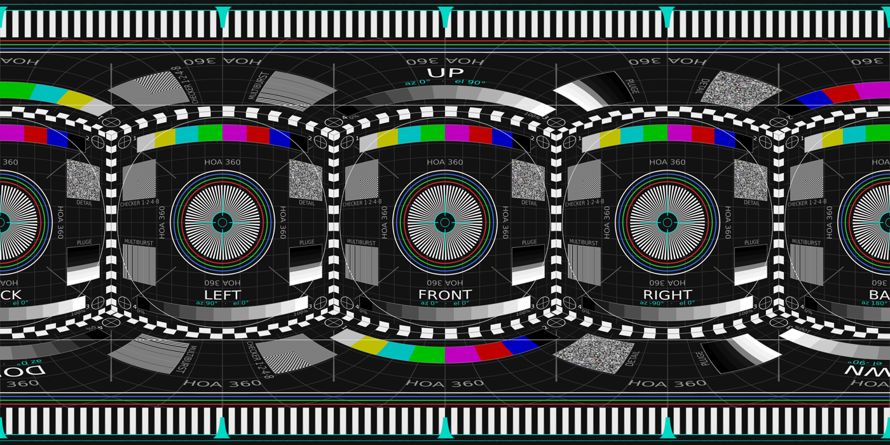
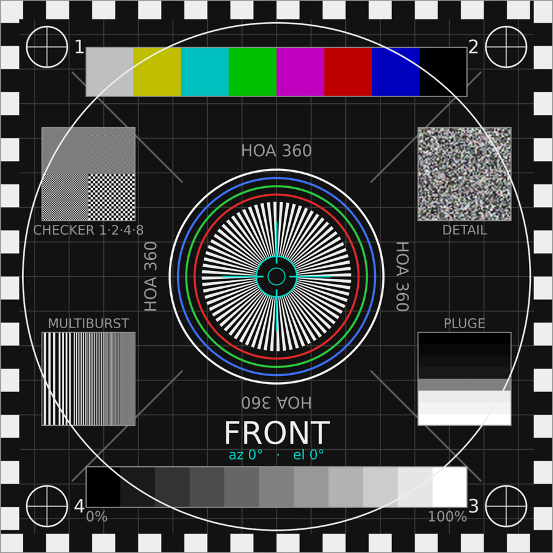
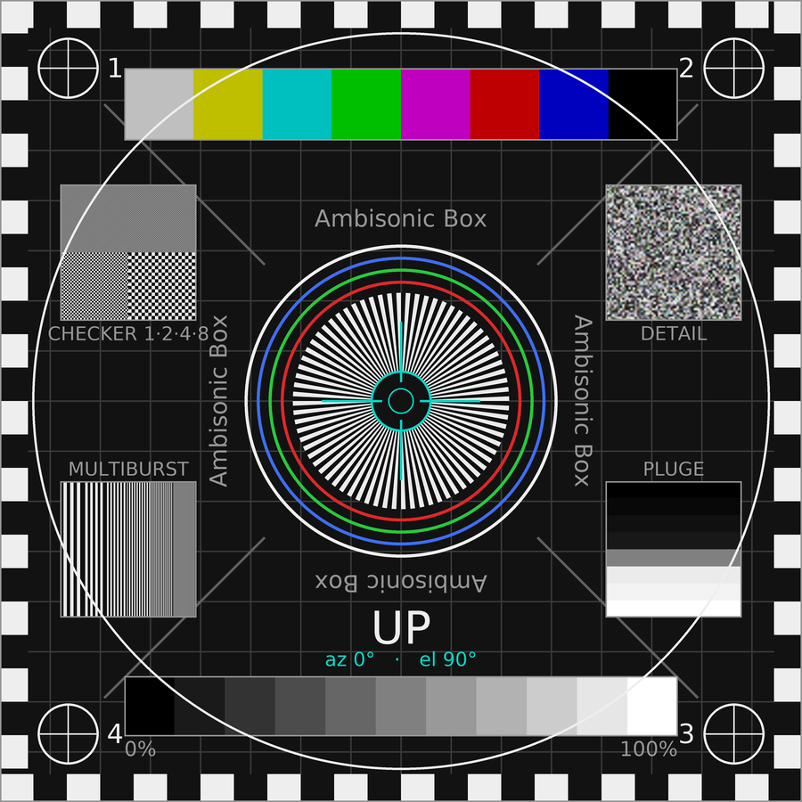

# On-demand VOD clips

Opt-in. The stack's purpose is live streaming; this page is everything about the on-demand side, summarised in five lines in the [main README](../README.md#on-demand-vod-clips).

## Enabling it

**Off by default.** Set `VOD_ENABLED=1` to serve the on-demand page; disabled, the `/vod/` and `/vod-dash/` routes return 404, the Live|VOD nav pill is removed, and loop-source skips the reference-master fetch. The two flags are independent: `DEMO_CONTENT` governs the live verification loop (placeholder synthesis), `VOD_ENABLED` governs the on-demand clips, and `VOD_ENABLED=0` suppresses the clip fetch even with `DEMO_CONTENT=1`.

When enabled, the player serves on-demand reference clips at `/vod/` (`/vod/?clip=<name>`). Delivery location is a `brand.json` choice: `vodBase` empty or absent serves the clips from this host's `/vod-dash/` route; setting it to a URL serves them from an external host that mirrors the `vod-dash/` tree (see [Serving VOD from object storage](#optional-serving-vod-from-object-storage) below for the CORS requirements). The player reads the key at clip start, so switching needs no rebuild.

## The two clips

Two are published as [release assets](https://github.com/mormegil6/hoa-360-stream/releases/tag/vod-clips) - no media is committed here, only the generators and the player wiring: `directions` (a 360 orientation test: the equirectangular test card from `scripts/make-360-testcard.py`, spoken **front, back, left, right, top and bottom** reads panned to those directions in third-order Ambisonics, and an energy-visualisation overlay rendered from that same stem, so the glow is baked into the picture and marks where each read is supposed to come from. That makes the clip testable by ear: the picture cannot drift, so if a word is not heard from the wall its glow and label agree on, the delivery chain scrambled the channels. The overlay is rendered by [AmbisonicEnergyRenderer](https://github.com/mormegil6/AmbisonicEnergyRenderer), a standalone tool that turns any ACN/SN3D file into an energy video; `scripts/make-directions-clip.sh` keys it over the card and tiles the result. Only the two recordings are not generated here) and `colortones` (colour-and-tone A/V-sync pattern, fully generated by `scripts/make-colortones.sh`). Put the masters in `content/vod/masters/` (gitignored); `scripts/encode-vod-ladder.sh` builds the resolution ladder and `scripts/package-vod-dash.sh` packages it into combined-MPD DASH under `content/vod/dash/<clip>/`, served at `/vod-dash/`.

## 360 test card

`scripts/make-360-testcard.py` renders six flat broadcast test screens and arranges them as the walls of a cube around the viewer, then inverse-projects that into equirectangular. Each wall spans exactly 90°, so a 360 viewer at a normal field of view sees a flat, undistorted card: circles stay round and straight lines stay straight, and any bend, softening or colour shift is the pipeline's doing rather than the projection's. Each face carries EBU 75 % colour bars, a grey staircase, PLUGE, a multiburst, a checkerboard, a band-limited detail patch and a Siemens star, plus its own name and centre bearing - so the picture reports resolution, gamma, range handling and compression damage in whichever direction you happen to be looking. The poles become ordinary ceiling and floor walls instead of smeared blobs. Drawing directly in equirectangular cannot do this: the pattern is pre-distorted, so nothing in it has a known shape by the time it reaches the eye.

<div align="center">  </div>

<p align="center"><em>The card as stored (equirectangular). The bowing is the projection: inside a 360 viewer each face reads flat, square and undistorted.</em></p>

<div align="center">   </div>

<p align="center"><em>The same card from inside, at a 90&deg; field of view: front (left) and straight up (right). This is the point of the cube arrangement. The front wall is flat and undistorted despite the bowing seen in the equirectangular image above, and the pole is an ordinary ceiling card rather than the smear that drawing directly in equirectangular produces there.</em></p>

```
scripts/make-360-testcard.py -o content/vod/masters/testcard-360_8k.png
scripts/make-360-testcard.py --pattern dummy --width 3072   # projection check
```

`--pattern dummy` swaps the artwork for deliberately asymmetric validation faces, which is how the geometry is checked independently of the picture. The mapping is the same one ffmpeg's `v360` filter implements, so `v360=c6x1:e` over a `right,left,up,down,front,back` strip is an independent cross-check (it agrees to 0.05/255). `scripts/make-orientation-card.py` remains as the plain measurement graticule - degree ticks and cardinal labels, no imaging targets.

The rendered 8K card ships as a **release asset** alongside the clip masters and caption sidecars; only the generator is tracked here, so a fresh clone reproduces the card rather than downloading it.

## Captions

Each clip carries WebVTT subtitles beside its segments as `captions_<lang>.vtt`, declared per clip in the `CLIPS` table in `services/hoast-player/index.html`:

```js
captions: [
  { src: '/vod-dash/directions/captions_en.vtt', lang: 'en', label: 'English' },
  { src: '/vod-dash/directions/captions_pl.vtt', lang: 'pl', label: 'Polski' }
]
```

The `.vtt` files are not tracked here - like the clip masters they ship as [release assets](https://github.com/mormegil6/hoa-360-stream/releases/tag/vod-clips), so a fresh `git clone` has the caption *config* but not the caption *files*. `scripts/make-colortones.sh` emits the colortones pair as part of generating that clip; `scripts/make-directions-captions.sh` (a flagged clip-specific one-off, since `directions` is a recording rather than something this repo generates) emits the directions pair.

The player side-loads these as native `<track>` elements rather than reading a DASH `text` AdaptationSet, which renders unreliably through videojs-contrib-dash (measured; see the note on the measurement notes under Documentation in the [main README](../README.md#documentation)). `services/hoast-player/vod-locations.conf` must therefore type `.vtt` as `text/vtt` in the `/vod-dash/` location: it's the registered, spec-correct MIME type, and current browsers key on the `WEBVTT` file signature regardless, but there's no reason to serve it as anything else.

## Playing it on a standalone headset

The clips play in a Meta Quest 3's own browser, with no app to install and nothing to configure. The headset's browser decodes the multichannel Opus directly and the page renders the sound field binaurally, the same as on desktop. There are two ways to watch, and the difference matters:

- **In the flat page**, the video sits in a window and you drag to look around.
- **In VR**, press the player's **VR** button. That enters a WebXR immersive session: you are inside the sphere, the headset's own tracking drives the view, and the ambisonic field rotates with your head. There is no dragging - you just look. Verified on a Quest 3 (2026-07-27).

The head tracking comes from different places in the two modes: device orientation sensors in the flat page, WebXR itself in an immersive session. That is why the sensor-permission problems that affect phones cannot apply once you are in VR mode.

That same session is where the `?dbg` capability probe was captured: the headset's browser decoded 2-, 16- and 25-channel Opus, which is in [docs/AMBISONIC-ORDER.md](AMBISONIC-ORDER.md#independent-corroboration-a-quest-3-decodes-both-layouts) next to the order-4 claim it corroborates.

## Optional: serving VOD from object storage

By default the stack serves the on-demand clips itself (`/vod-dash/` out of `content/vod/dash`). If you front the player with a CDN, check its terms before leaving large video on that path: [Cloudflare's terms](https://blog.cloudflare.com/updated-tos), for example, restrict serving large non-Cloudflare-hosted video through their proxy, while content hosted by a Cloudflare service such as R2 is explicitly exempt - offloading VOD to an object-storage origin (Cloudflare R2, for example) avoids the restriction.

To do the same: upload `content/vod/dash/` to a bucket under a `vod-dash/` prefix, attach a custom domain, allow CORS from your player origin including the `range` request header (DASH SegmentBase addresses by byte range), and set `vodBase` in `brand.json` to that domain. Removing the key falls back to box-served VOD instantly; the local copy and route stay in place either way.
