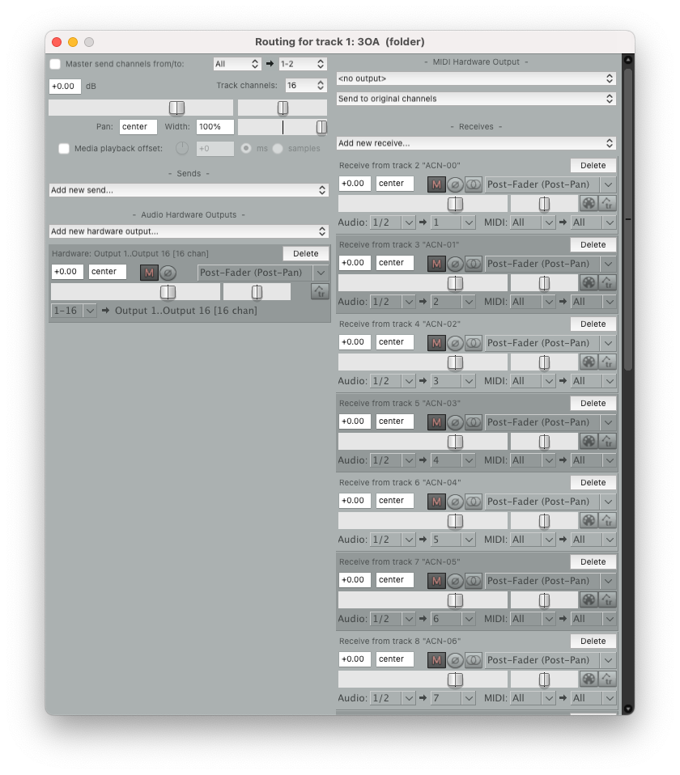
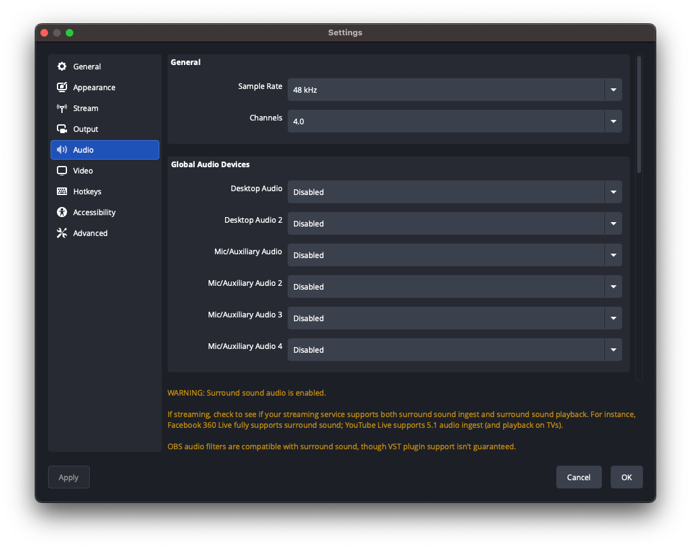
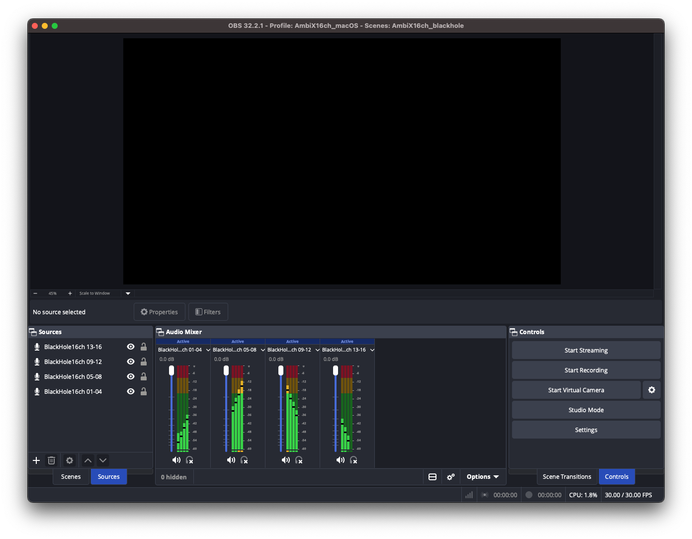
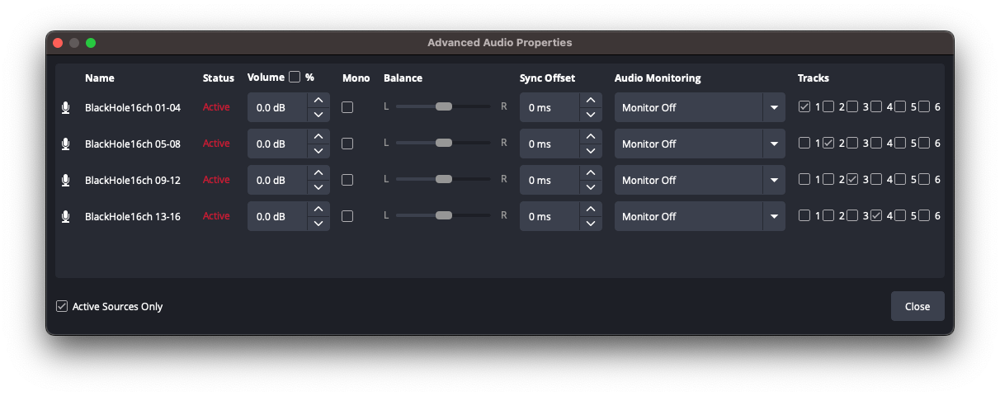
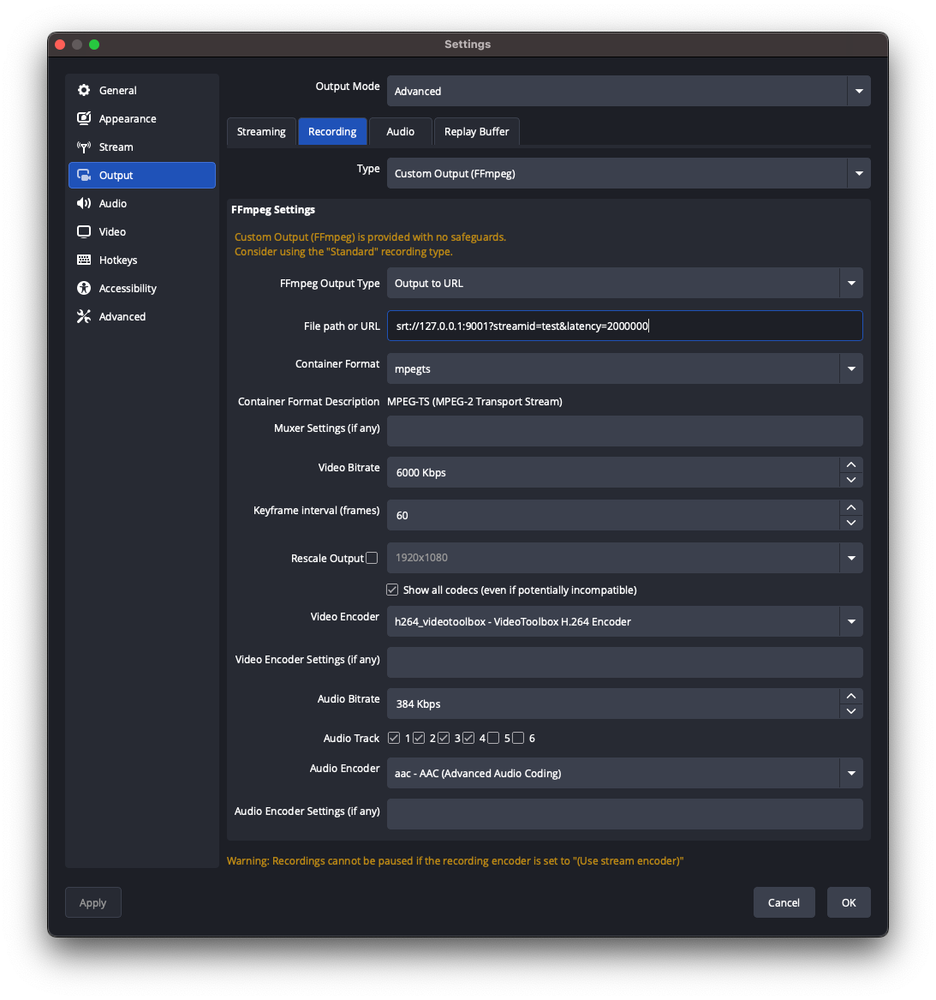

# Stock OBS on macOS: 16 channels over SRT

Everything here was established by pushing a per-channel tone ladder through real hardware and reading back what arrived. Where a setting looks arbitrary, it is not: the obvious-looking alternative fails silently, and the note says how.

Verified on [OBS Studio](https://obsproject.com/) 32.2.1 and [REAPER](https://www.reaper.fm/) 7.78, macOS, with [BlackHole](https://github.com/ExistentialAudio/BlackHole) as the multichannel device. SRT is Secure Reliable Transport, the contribution protocol this stack recommends: stock OBS speaks it, and it carries the four audio tracks that become your 16 channels.

The steps run in the same order as [the Windows guide](obs-windows.md). Only steps 1 and 3 differ, because macOS has BlackHole and Windows does not.

## What you need

- **[OBS Studio](https://obsproject.com/)** (stock - no patched fork).
- **A multichannel Core Audio device** carrying your 16 ambisonic channels. [BlackHole](https://github.com/ExistentialAudio/BlackHole) (16ch or 64ch) is the usual choice; an aggregate device built from your interface works too.
- **A source of 16 channels.** [REAPER](https://www.reaper.fm/) is what this guide uses, and the fixture project below is a REAPER project; anything that can send AmbiX (ACN/SN3D) channels 1-16 into the device will do.

**You can import most of this instead of typing it.** The OBS side ships as two presets: a **profile** ([`docs/fixtures/obs-macos-profile/`](fixtures/)), which carries the channel count and the whole Recording tab, and a **scene collection** ([`docs/fixtures/obs-macos-blackhole.json`](fixtures/)), which carries the four sources and their track assignments. Import them from OBS's **Profile > Import** and **Scene Collection > Import** menus and steps 2 to 5 are done bar the URL, which you still have to point at your own box. The steps are written out anyway, because it is worth knowing what the preset did and where to look when it does not work.

## 1. Send 16 channels into BlackHole

Set REAPER's audio device to the multichannel device, at 48 kHz.

<div align="center"></div>

To test the chain rather than your own content, open [`docs/fixtures/AmbiX16ch_StreamTest-Mac.RPP`](fixtures/): sixteen mono tracks, `ACN-00` to `ACN-15`, each carrying one tone of a 100-1600 Hz ladder at its own level, already routed. One tone per channel is what makes channel order and channel loss *visible* rather than a matter of opinion, and it needs only a stock REAPER JS plugin.

<div align="center"></div>

**The routing is two layers.** Each mono child feeds a single 16-channel bus (`3OA`) through an internal send, one send per destination channel: `ACN-00` into channel 1, on up to `ACN-15` into channel 16. Only that bus carries a **hardware output**, mapped `1-16 -> Output 1..16`, and its **Master send is unticked** so the ladder never reaches your monitors.

Sixteen individual hardware outputs would work too. The bus is worth the extra track because it puts the entire channel mapping in one dialog you can read at a glance - and it is where an ambisonic encoder would sit if you were producing content rather than testing.

Those outputs are numbered rather than named because on macOS the *device* is chosen back in Preferences > Audio > Device, so `Output 1..16` here means channels 1-16 of BlackHole. On Windows the same list shows ReaRoute by name instead.

<div align="center"></div>

**Record-arm the tracks.** REAPER's audio engine otherwise goes quiet once another application takes focus, which is exactly what happens the moment you click into OBS - the meters there fall silent and it looks like the routing is broken. Arming keeps the engine running in the background so the tones keep flowing while you work in OBS.

**What the fixture is not.** It feeds each ACN channel a bare tone, so nothing in it is *panned*: it is a test signal, not a mix. Real material goes through an ambisonic encoder first - a panner takes a mono or stereo source and a direction, and computes the ACN/SN3D components that place it there, which is what the 16 channels then carry (the [IEM Plug-in Suite](https://git.iem.at/audioplugins/IEMPluginSuite) is the usual free choice). The tone ladder deliberately skips that step, because a signal that has been panned is spread across many channels at once and tells you nothing about which channel went where. One tone per channel is what makes an off-by-one or a dropped channel visible.

## 2. Set the global channel layout in OBS

**Settings > Audio > Channels: `4.0`**

Not 7.1. This governs the channel *width* of every track in the output regardless of how many channels a source actually carries, and it is a separate gate from anything the sources are configured to do. Left at 7.1 every 4-channel track is widened to 8 and the recording reads back as 32 channels instead of 16, with nothing to warn you at capture time - only a channel count of the recording reveals it, which is what [Proving the channel order](#proving-the-channel-order) does. A 7.1 layout also carries an LFE slot that OBS mutes outright: channel 4 of every track arrives digital-silent, measured at -99 dBFS on a real macOS capture, which for ambisonics erases ACN 3, the X axis. Exactly where a 4-channel source lands inside a 7.1 track was never measured, so treat a 7.1 capture as unusable rather than as padding you can strip. Set it before you build anything else, so nothing downstream is measured against the wrong width.

**Channels is the only field on that page that matters.** Every global audio device dropdown can stay **Disabled** - your 16 channels arrive as *sources*, not as global devices.

<div align="center"></div>

OBS then warns that surround sound is enabled and lists which streaming services cope with it. That warning is aimed at people sending 5.1 to a video platform; here the four channels never reach a service that has an opinion about them, so it can be ignored.

While you are in Settings, two fields under **Advanced > Video** are worth setting, and they turn out to be the same story.

**Color Range: Limited**, not Full. This project's rule is limited range throughout - full-range video broke the dash.js/MSE player with `PIPELINE_ERROR_DECODE` (see the [README's troubleshooting table](../README.md#running)) - and under the passthrough video path OBS's H.264 reaches the player untouched, so OBS is the first place in the chain that can set it wrong. That was measured on VP9 rather than H.264, but limited range costs nothing either way.

**Color Format: NV12**, the 8-bit 4:2:0 layout H.264 encoders consume natively, so nothing has to convert each frame. This one is a precaution rather than a measurement here: it comes from [obs-studio issue #8226](https://github.com/obsproject/obs-studio/issues/8226), a Windows report of heavy frame drops on the Custom Output (FFmpeg) path that switching to NV12 cured, closed as not planned. Read that report alongside the paragraph above, though - having fixed the drops, the reporter complained that NV12 gave "horribly burned/washed out colors", which is the signature of a range mismatch rather than anything NV12 did. Setting the range explicitly is what keeps you out of that second problem.

## 3. Bring the 16 channels into OBS

Add four **Audio Input Capture** sources on your multichannel device, one per group of four channels:

| Source | Device channels | Assign to track |
|---|---|---|
| 1 | 1-4 | Track 1 |
| 2 | 5-8 | Track 2 |
| 3 | 9-12 | Track 3 |
| 4 | 13-16 | Track 4 |

Turn **downmixing off** on each.

<div align="center"></div>

Four sources now appear in the OBS **Sources** panel. Rename each one to carry its channel range - the four in the fixture preset are `BlackHole16ch 01-04`, `05-08`, `09-12` and `13-16`. Nothing downstream reads the names, but the next step asks you to match each source to a track number, and generic names make that easy to get wrong. With the tone ladder playing, all four should show signal:

<div align="center"></div>

## 4. Assign one source per track

**Advanced Audio Properties** (right-click any source in the Audio Mixer): assign `BlackHole16ch 01-04` to Track 1, `05-08` to Track 2, `09-12` to Track 3, `13-16` to Track 4. Tick exactly one track per source and untick the rest.

<div align="center"></div>

The join downstream is strictly positional - track 1 becomes channels 1-4, track 2 becomes 5-8, and so on, never a downmix - so AmbiX order survives end to end provided the mapping above is exact.
**Sending 1st order (4 channels) instead?** Then this whole step is one line: a single 4-channel source on Track 1, and nothing on tracks 2 to 4. In [section 5](#5-point-obs-at-the-box) tick only **Track 1**. Everything else on this page is the same, including the URL. The box reads how many tracks arrive and treats one 4-channel track as 1st order and four as 3rd, so there is nothing to set at that end.


## 5. Point OBS at the box

**First, on the box: the owner route has to exist before you can push to it.** In the stack folder run `./scripts/setup.sh` once, then `docker compose up -d`. That generates your own publish key and passphrase, enables the authenticated SRT route on UDP 8891, and prints the exact URL to paste below. It is safe to re-run and will not overwrite an existing `.env`.

This is the route you want for your own broadcasts: every caller is authenticated by your key, which SRT uses as the connection's AES key, so anyone without it is refused at the handshake. The separate *guest* endpoint exists for letting **other** people push to your box, takes no password at all, and stays off unless you turn it on - see [the variant at the end of this section](#variant-the-keyless-guest-endpoint) if that is what you are after.

### Getting your passphrase

Re-running setup prints the whole URL with your passphrase already in it, and that is the one to paste. If you have closed that window, ask the running stack what it is actually using:

```bash
docker compose exec srt-gateway-owner printenv SRT_OWNER_PASSPHRASE
```

Authoritative, because it reports the value the gateway is running with rather than what a file says it should be. Same name in `.env` and in the container, so there is nothing to translate. With the stack down, `grep SRT_OWNER_PASSPHRASE .env` does the same job.

Filled in, the URL looks like this. **The passphrase below is an example - yours will be different**, and pasting this one will be refused at the handshake:

```
srt://127.0.0.1:8891?streamid=owner&passphrase=th1s-is-n0t-your-passphrase-check-your-env-file&latency=2000000&pkt_size=1128
```

Everything except the passphrase is literal, including the word `owner` in `streamid=owner`. `127.0.0.1` is right when OBS runs on the box itself. Anywhere else, replace only that part with the address you reach the box on, and leave the rest exactly as it is.

**Beware a space in front of `srt://` when you paste.** It is invisible in that field, and it does not fail the way you would expect: ffmpeg stops recognising `srt://` as a protocol and treats the whole string as a filename, so OBS reports `No such file or directory` and it reads as though the box is unreachable. On Windows the same paste says `Invalid argument` instead. If you meet either, click into the field, press Home, and delete one character before believing anything else. Diagnosed the hard way on 2026-08-10.

**Then, in OBS: Settings > Output > Output Mode: `Advanced`**, then the **Recording** tab:

| Setting | Value |
|---|---|
| Type | **Custom Output (FFmpeg)** |
| FFmpeg Output Type | **Output to URL** |
| File path or URL | `srt://<box-address>:8891?streamid=owner&passphrase=<SRT_OWNER_PASSPHRASE>&latency=2000000&pkt_size=1128` - `127.0.0.1` if OBS runs on the box, otherwise the address you reach it on |
| Container Format | **mpegts** |
| Audio Encoder | plain **`aac`** - tick **"Show all codecs"** if it is hidden |
| Audio Track | tick **1, 2, 3, 4** |
| Video Encoder | any H.264 encoder; keyframe interval 2 s, CFR |
| Bitrates | see [Contribution bitrate](BITRATE.md) - audio 384 kbit/s per track, video against your uplink |

<div align="center">&latency=2000000&pkt_size=1128, Container Format mpegts, Video Bitrate 20000 Kbps, Keyframe interval 60, Show all codecs ticked, Video Encoder h264_videotoolbox, Audio Bitrate 384 Kbps, Audio Track 1 to 4 ticked and 5 to 6 clear, Audio Encoder aac."></div>

<p align="center"><em>The URL carries both parameters that matter: <code>&amp;latency=2000000</code>, since SRT's default of about 120 ms survives loopback and little else, and <code>&amp;pkt_size=1128</code>, for the reason in <a href="#5-point-obs-at-the-box">the tunnel trap below</a>. The passphrase is shown as a placeholder; <code>./scripts/setup.sh</code> prints your real one. <code>127.0.0.1</code> is right only when OBS runs on the box, otherwise put the address you reach it on. The 20000 Kbps here is for 8K; 6000 suits 4096x2048, so set it against your own resolution and uplink rather than copying the figure.</em></p>

The screenshot shows **`h264_videotoolbox`**, Apple's hardware encoder, which keeps the work off the CPU. `libx264` is the software fallback and is present on every machine. Whichever you choose, keep the keyframe interval at 60 frames - 2 s at 30 fps - because that is what the segment duration downstream is aligned to.

Four traps in that table, all silent:

- **`latency` is in MICROSECONDS.** 2 s is `2000000`. Writing `2000` asks for 2 ms and the stream will not survive the smallest amount of loss.
- **Through a tunnel, cap the packet size.** SRT's default packet is about 1316 bytes, but a WireGuard or Tailscale tunnel carries a 1280-byte MTU, so every packet fragments - and under load a large share of the fragments never reassemble, so the picture arrives shredded (blocky green and magenta, the player aborting with a decode error) while SRT still reports the link up. Add `&pkt_size=1128` (six 188-byte transport packets, which fits) to the URL; it is harmless on an ordinary 1500-byte path and essential on a tunnelled one.
- **The default audio encoder is `mp2`, which flatly refuses more than 2 channels.** You get "Failed to open audio codec: Invalid argument" and nothing else.
- **Never `aac_at`.** That is Apple's CoreAudio encoder, and its 4-channel AAC decodes in MPEG transmission order (C, L, R, Cs) - which reads back as a scrambled `[3, 1, 2, 4]` inside every track. Plain `aac` round-trips cleanly.

Leave **Muxer Settings** empty; PID remapping is cosmetic for an ffmpeg receiver.

### Pushing from another machine

The URL above uses whatever address reaches your box. To stream from a different machine than the box, two things:

1. **On your router**, forward UDP 8891 to the box. The owner route already listens on all interfaces, so there is nothing to change on the box itself.
2. **In OBS**, put the address you reach the box on into the same URL:

`srt://<address-you-reach-the-box-on>:8891?streamid=owner&passphrase=<SRT_OWNER_PASSPHRASE>&latency=2000000&pkt_size=1128`

That is the whole thing: an address, a port, your key, and the stream goes. The URL has the same shape whether you reach the box over a LAN, a VPN or the open internet, so nothing about your OBS setup changes when you travel.

**Why a key is enough.** SRT's passphrase is not a password checked after the request has been parsed - it is the AES key for the connection itself, so libsrt refuses the handshake before a single byte of your stream reaches the demuxer. An unauthenticated caller never gets as far as the parser. It is also less exposure than the guest endpoint on 8890, which takes no key at all.

**What it costs, plainly.** The port becomes scannable, so libsrt's handshake is your pre-auth surface. `GUEST_MAX_TEMP_C` and `GUEST_MAX_MBPS` belong to the guest arbiter and do not apply to owner sessions, so nothing but you throttles a misconfigured encoder. And anyone who obtains the passphrase can broadcast on your box. Use the generated one rather than one you invented, and rotate it if a venue machine has ever held it.

**If you want less exposure**, narrow the bind in the `srt-gateway-owner` ports line of `docker-compose.override.yml`: `127.0.0.1` for this machine only, or a VPN address (Tailscale, WireGuard) to keep the port off the internet entirely. On a host that holds a routable address of its own - a VPS rather than something behind NAT - binding that exact IP opens one interface instead of all of them.

> **Do not bind a public IP the box does not actually hold.** Behind NAT that address belongs to your router, not the box, and binding it *looks* like it worked: the container reports healthy and `ss` lists the socket, but no packet ever arrives. Normally this errors. On a host with `net.ipv4.ip_nonlocal_bind=1` set (which [docs/ENDPOINTS.md](ENDPOINTS.md) recommends, for an unrelated boot race) it does not even do that. `ip -4 addr show scope global` shows what the box really holds. When in doubt, `0.0.0.0` is always correct.

### Variant: the keyless guest endpoint

Everything above sends **your** stream, authenticated. The guest endpoint answers a different question: letting somebody else push to your box without giving them a key. Two differences in the OBS settings, and only two:

| | Owner (above) | Guest |
|---|---|---|
| URL | `srt://<box>:8891?streamid=owner&passphrase=<SRT_OWNER_PASSPHRASE>&...` | `srt://<box>:8890?streamid=<any-name>&...` |
| Reachable from | loopback, a VPN address, or a forwarded public port | wherever the guest is, so a LAN or public address |

Turn it on with `GUEST_ENABLED=1` in `.env` and `docker compose up -d`. The dashboard on `:8090` then shows a **GUEST ENDPOINT** row reading `free`; while it is off that row reads `disabled` and every push is refused with a bare `Couldn't open ... I/O error` that looks like a network fault and is not one. Sessions are capped, rate-limited and logged - the rules are in [docs/GUEST-ENDPOINT.md](GUEST-ENDPOINT.md). Read that before exposing it, because it genuinely takes no password from anyone.

## 6. Push it

Press **Start Recording**.

That is not a typo. Custom Output (FFmpeg) is a *recording* output in OBS even when its destination is a URL, so it lives on the Recording tab and Start Recording is what pushes it. Start Streaming does nothing for it.

The stream appears on the player page within a few seconds of the first keyframe.

Custom Output (FFmpeg) does **not** auto-reconnect. If the connection drops you have to press Start again. On the owner route that simply resumes; on the guest endpoint your slot is held for a grace window (default 120 s), so a prompt reconnect continues the same session rather than starting a new one.

## If it does not work

| Symptom | Cause |
|---|---|
| "Failed to open audio codec: Invalid argument" | Audio encoder is still `mp2`. Tick "Show all codecs" and pick plain `aac`. |
| Connects, but the player shows nothing and the session auto-ends after ~45 s | The stream is not four 4-channel tracks. Check Settings > Audio > Channels is `4.0` and that all four tracks are ticked in the output. |
| Audio arrives but the ambisonic field is wrong | Channel order. Verify with a tone ladder (below) before blaming the renderer. |
| Channel 4 of each group silent | Global Settings > Audio > Channels is `7.1`, not `4.0`. |

## Proving the channel order

Do not trust the chain by ear. Play the tone-ladder project from [step 1](#1-send-16-channels-into-blackhole), record locally, and check what came back:

```bash
./scripts/merge-obs-tracks.sh --check recording.mkv     # expect: 4 track(s), channels per track: 4 4 4 4
./scripts/merge-obs-tracks.sh recording.mkv merged.mov --channels 16
ffmpeg -v error -ss 5 -i merged.mov -map 0:a:0 -t 1.5 -f s16le -c:a pcm_s16le - \
  | python3 scripts/check-tones.py 16 48000 100 100
```

The last two arguments are the ladder's base frequency and step, so adjust them to whatever tones you generated. `check-tones.py` asserts channel *k* carries tone *k* and fails a channel that is silent, so a scramble and a muted channel are both caught rather than guessed at. `scripts/test-srt-ingest.sh` runs the same assertion through the live SRT path end to end.

## See also

- [obs-windows.md](obs-windows.md) - the same recipe on Windows, where the audio routing differs
- the [main README](../README.md) for the RTMP path and the guest endpoint's session rules
