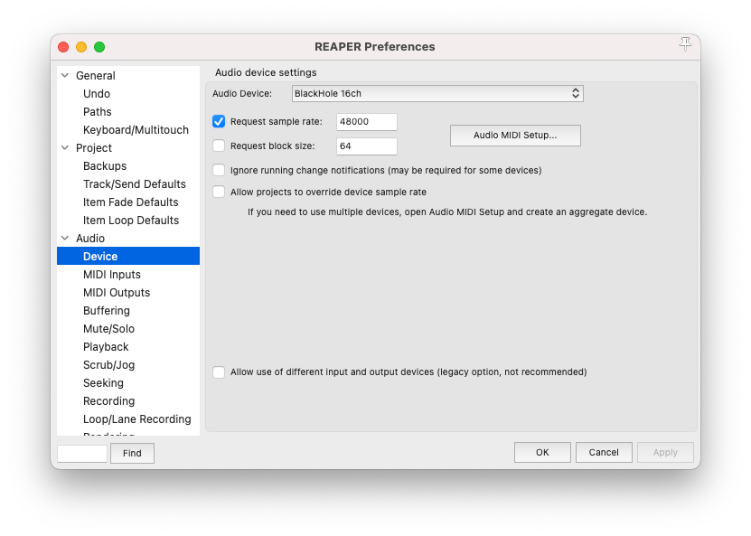
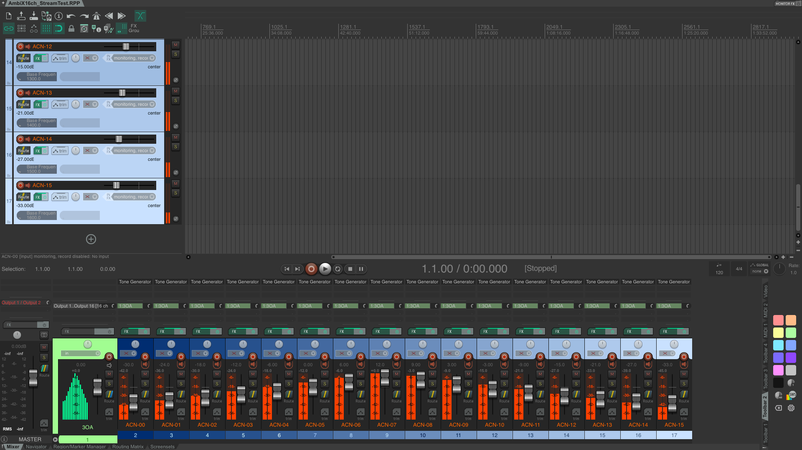
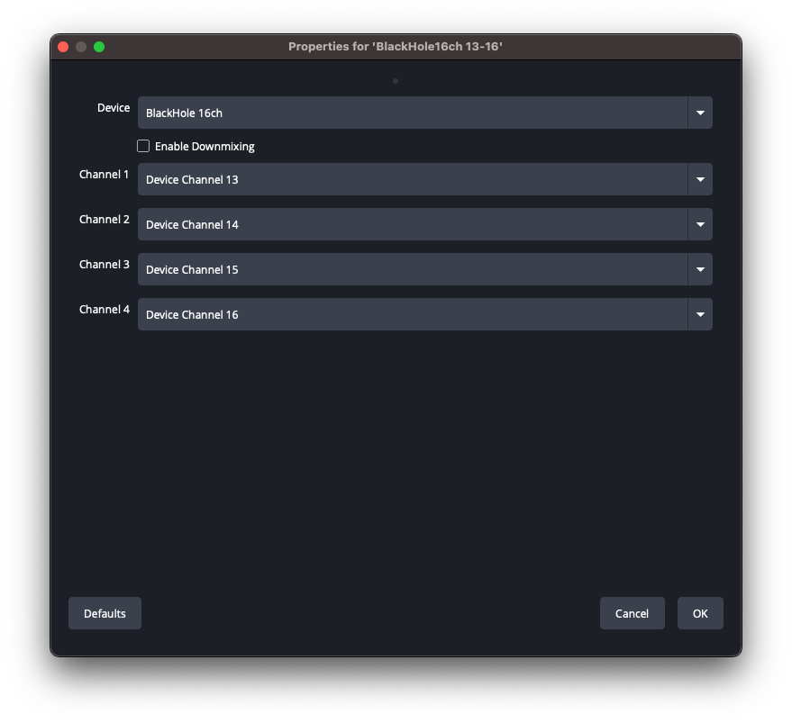

# Stock OBS on macOS: 16 channels over SRT

Everything here was established by pushing a per-channel tone ladder through real hardware and reading back what arrived. Where a setting looks arbitrary, it is not: the obvious-looking alternative fails silently, and the note says how.

Verified on [OBS Studio](https://obsproject.com/) 32.2.1 and [REAPER](https://www.reaper.fm/) 7.78, macOS, with [BlackHole](https://github.com/ExistentialAudio/BlackHole) as the multichannel device.

## What you need

- **[OBS Studio](https://obsproject.com/)** (stock - no patched fork).
- **A multichannel Core Audio device** carrying your 16 ambisonic channels. [BlackHole](https://github.com/ExistentialAudio/BlackHole) (16ch or 64ch) is the usual choice; an aggregate device built from your interface works too. Your DAW or player sends AmbiX (ACN/SN3D) channels 1-16 into it.

<div align="center"></div>

**To test the chain rather than your own content**, open [`docs/fixtures/AmbiX16ch_StreamTest-Mac.RPP`](fixtures/): a 16-channel `3OA` parent with sixteen mono children, `ACN-00` to `ACN-15`, each carrying one tone of a 100-1600 Hz ladder at its own level. One tone per channel is what makes channel order and channel loss *visible* rather than a matter of opinion, and it needs only a stock REAPER JS plugin.

**Record-arm the tracks.** REAPER's audio engine otherwise goes quiet once another application takes focus, which is exactly what happens the moment you click into OBS - the meters there fall silent and it looks like the routing is broken. Arming keeps the engine running in the background so the tones keep flowing while you work in OBS.

<div align="center"></div>


## 1. Set the global channel layout

**Settings > Audio > Channels: `4.0`**

Not 7.1. OBS's 7.1 path mutes the LFE slot outright - channel 4 of every track arrives digital-silent (measured at -99 dBFS on a real capture). For ambisonics that erases ACN 3, the X axis, and nothing warns you.

This setting governs the width of every track, independently of how many channels a source actually carries. It has to match the shape you intend or the output is silently padded.

<div align="center"></div>


## 2. Four capture sources, one per track

Add four **Audio Input Capture** sources on your multichannel device, one per group of four channels:

| Source | Device channels | Assign to track |
|---|---|---|
| 1 | 1-4 | Track 1 |
| 2 | 5-8 | Track 2 |
| 3 | 9-12 | Track 3 |
| 4 | 13-16 | Track 4 |

Turn **downmixing off** on each. Assign tracks in **Advanced Audio Properties** (right-click any source in the Audio Mixer): tick exactly one track per source, and untick the rest.

<div align="center"></div>

Name them so the channel range is visible at a glance - the four in the fixture preset are `BlackHole16ch 01-04`, `05-08`, `09-12` and `13-16`. With the tone ladder playing, all four should show signal:

<div align="center"></div>


The join downstream is strictly positional - track 1 becomes channels 1-4, track 2 becomes 5-8, and so on, never a downmix - so AmbiX order survives end to end provided the mapping above is exact.

<div align="center"></div>


## 3. Point OBS at the box

**Settings > Output > Output Mode: `Advanced`**, then the **Recording** tab:

| Setting | Value |
|---|---|
| Type | **Custom Output (FFmpeg)** |
| FFmpeg Output Type | **Output to URL** |
| File path or URL | `srt://<host>:8890?streamid=<your-name>&latency=2000000` |
| Container Format | **mpegts** |
| Audio Encoder | plain **`aac`** - tick **"Show all codecs"** if it is hidden |
| Audio Track | tick **1, 2, 3, 4** |
| Video Encoder | any H.264 encoder; keyframe interval 2 s, CFR |
| Bitrates | see [Bitrate](../README.md#bitrate) - audio 384 kbit/s per track, video against your uplink |

Three traps in that table, all silent:

- **`latency` is in MICROSECONDS.** 2 s is `2000000`. Writing `2000` asks for 2 ms and the stream will not survive the smallest amount of loss.
- **The default audio encoder is `mp2`, which flatly refuses more than 2 channels.** You get "Failed to open audio codec: Invalid argument" and nothing else.
- **Never `aac_at`.** That is Apple's CoreAudio encoder, and its 4-channel AAC decodes in MPEG transmission order (C, L, R, Cs) - which reads back as a scrambled `[3, 1, 2, 4]` inside every track. Plain `aac` round-trips cleanly.

Leave **Muxer Settings** empty; PID remapping is cosmetic for an ffmpeg receiver.

<div align="center"></div>

<p align="center"><em>Captured against a local test listener; point the host and port at your own box. The URL form is what matters - note <code>&amp;latency=2000000</code>, since SRT's default of about 120 ms survives loopback and little else.</em></p>


## 4. Push it

Press **Start Recording**.

That is not a typo. Custom Output (FFmpeg) is a *recording* output in OBS even when its destination is a URL, so it lives on the Recording tab and Start Recording is what pushes it. Start Streaming does nothing for it.

The stream appears on the player page within a few seconds of the first keyframe.

Custom Output (FFmpeg) does **not** auto-reconnect. If the connection drops you have to press Start again; the guest endpoint holds your slot for a grace window (default 120 s) so a prompt reconnect continues the same session.

## If it does not work

| Symptom | Cause |
|---|---|
| "Failed to open audio codec: Invalid argument" | Audio encoder is still `mp2`. Tick "Show all codecs" and pick plain `aac`. |
| Connects, but the player shows nothing and the session auto-ends after ~45 s | The stream is not four 4-channel tracks. Check Settings > Audio > Channels is `4.0` and that all four tracks are ticked in the output. |
| Audio arrives but the ambisonic field is wrong | Channel order. Verify with a tone ladder (below) before blaming the renderer. |
| Channel 4 of each group silent | Global channels is `7.1`, not `4.0`. |

## Proving the channel order

Do not trust the chain by ear. Play the tone-ladder project from [What you need](#what-you-need) above, record locally, and check what came back:

```bash
./scripts/merge-obs-tracks.sh --check recording.mkv     # expect: 4 track(s), channels per track: 4 4 4 4
./scripts/merge-obs-tracks.sh recording.mkv merged.mov --channels 16
ffmpeg -v error -ss 5 -i merged.mov -map 0:a:0 -t 1.5 -f s16le -c:a pcm_s16le - \
  | python3 scripts/check-tones.py 16 48000 100 100
```

`check-tones.py` asserts channel *k* carries tone *k* and fails a channel that is silent, so both failure modes above are caught rather than guessed at. `scripts/test-srt-ingest.sh` runs the same assertion through the live SRT path end to end.

## See also

- [obs-windows.md](obs-windows.md) - the same recipe on Windows, where the audio routing differs
- the [main README](../README.md) for the RTMP path and the guest endpoint's session rules
