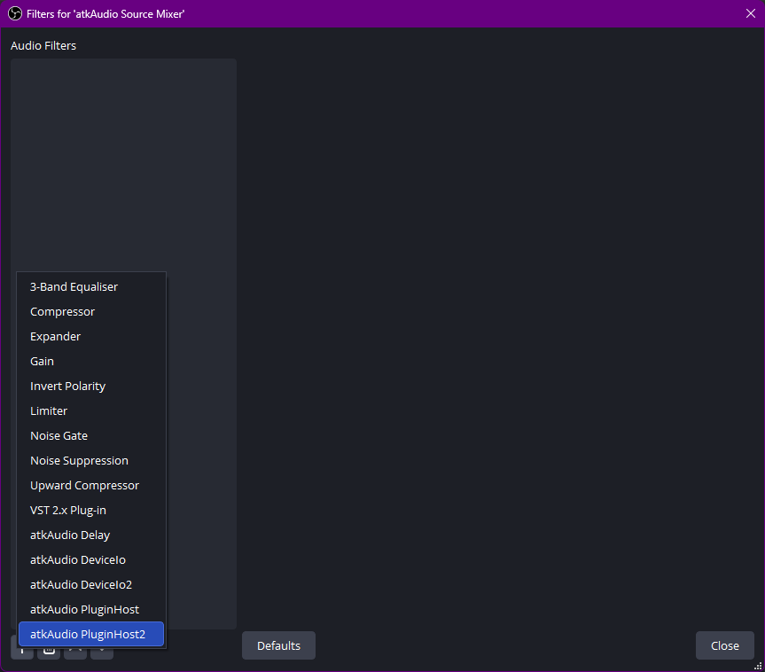
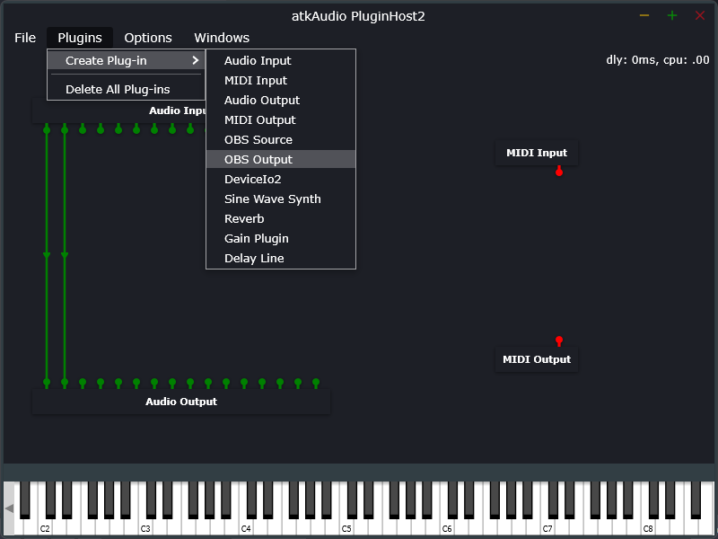
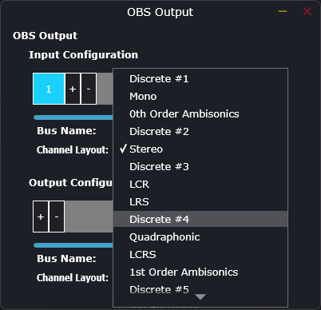
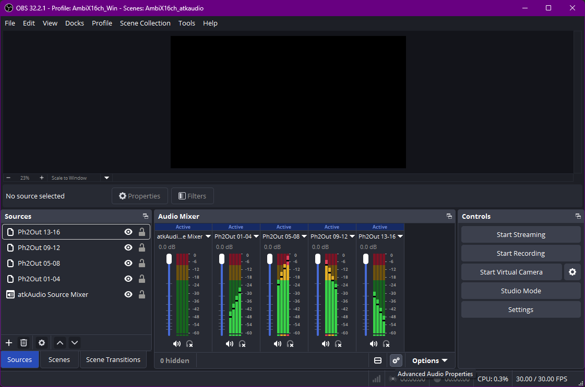
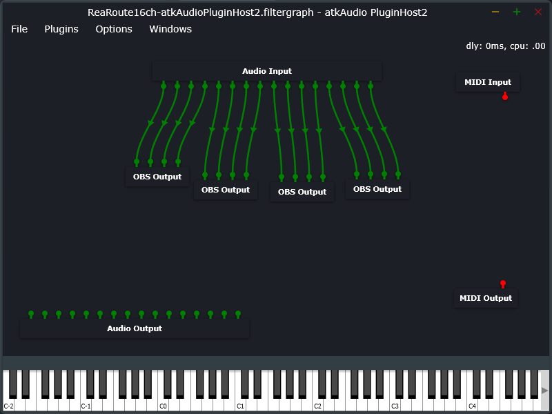
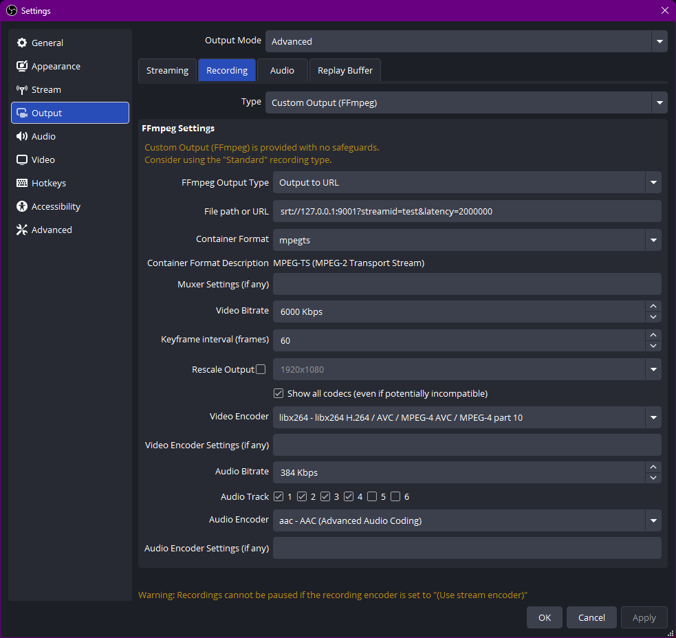

# Stock OBS on Windows: 16 channels over SRT

Everything here was established by pushing a per-channel tone ladder through real hardware and reading back what arrived. Where a setting looks arbitrary, it is not: the obvious-looking alternative fails silently, and the note says how.

Verified on [OBS Studio](https://obsproject.com/) 32.2.1 and [REAPER](https://www.reaper.fm/) 7.78 with ReaRoute, Windows 11.

The stream settings are identical to [macOS](obs-macos.md). What differs is getting 16 channels *into* OBS in the first place: Windows has no BlackHole, so the route is ASIO.

## What you need

- **[OBS Studio](https://obsproject.com/) 31.1.1 or newer** (stock - no patched fork).
- **[atkAudio plugin](https://obsproject.com/forum/resources/atkaudio-plugin.2099/)** ([releases](https://github.com/atkAudio/PluginForObsRelease/releases/latest)). OBS has no native ASIO input, and `obs-asio` is abandoned with an open ReaRoute distortion bug on OBS 30+; atkAudio is its named successor. (OBS 33.0 is expected to bring a native ASIO host, which would make this plugin unnecessary.)
- **An ASIO source of 16 channels.** [REAPER](https://www.reaper.fm/)'s **ReaRoute** is the convenient one - it ships with REAPER and appears as an ASIO device to other applications. ReaRoute does *not* need to be REAPER's own audio device: it is an additional hardware-output target, so REAPER can run on Dummy Audio and still feed it.

## 1. Send 16 channels into ReaRoute

In REAPER, route each of your 16 ambisonic channels to a distinct ReaRoute output (track 1 → ReaRoute 1, ... track 16 → ReaRoute 16), via each track's hardware output.

To test the chain rather than your content, open [`docs/fixtures/AmbiX16ch_StreamTest-Win.RPP`](fixtures/) - 16 tracks already carrying a 100-1600 Hz tone ladder, one tone per channel, routed to ReaRoute 1-16.

**Record-arm the tracks.** REAPER's audio engine otherwise goes quiet once another application takes focus, which is exactly what happens the moment you click into OBS - the meters there fall silent and it looks like the routing is broken. Arming keeps the engine running in the background so the tones keep flowing while you work in OBS.

<div align="center"></div>

## 2. Bring ReaRoute into OBS

atkAudio's real interface is a node-graph editor, and it is not where you would expect - the source's own OBS **Properties** dialog says "No properties available" by design.

1. **Add Source > atkAudio Source Mixer.** This exists only to host a filter. Do **not** try to use its own combine-sources feature to merge channels: it is capped at stereo and it sums rather than preserving channels, which would destroy the ambisonic field.

<div align="center"></div>
2. Right-click that source > **Filters > + > atkAudio Plugin Host2**. A separate floating **atkAudio PluginHost2** window opens. That is the real interface.

<div align="center"></div>
3. In that window: **Options > Change Device Settings**. Set Device to **ReaRoute ASIO**, sample rate to match your REAPER project (48000 Hz), and tick all 16 channels under **Active INPUT channels** ("ReaRoute REAPER=>CLIENT" - audio coming *from* REAPER). Leave the Active OUTPUT list alone; that direction sends OBS audio back to REAPER and is not used here.

<div align="center"></div>
4. **Plugins > Create Plug-in > OBS Output**, four times - one instance per group of four channels. Wire Audio Input ports 1-4 into the first, 5-8 into the second, 9-12 into the third, 13-16 into the fourth. Order matters: this is what preserves AmbiX channel order.

<div align="center"></div>
5. **Each OBS Output node defaults to stereo.** Right-click the **node itself** (not a port, and not its OBS Properties dialog) > **Configure Audio I/O**, and set the Channel Layout to **Discrete #4** on *both* the Input and Output Configuration. Repeat for all four nodes.

   Use "Discrete", not a named surround layout like Quad - untagged channels cannot be semantically remapped by anything downstream.

   This step is undocumented upstream. A search of the plugin's forum thread, its whole changelog, its reviews and every GitHub issue turned up no mention of it; without it, each node stays stereo and you cannot get past 8 channels.

<div align="center"></div>

<div align="center"></div>

Four sources named `Ph2Out 01-04`, `Ph2Out 05-08`, `Ph2Out 09-12`, `Ph2Out 13-16` now appear in OBS with real level meters.

<div align="center"></div>

To skip steps 4 and 5, load [`docs/fixtures/ReaRoute16ch-atkAudioPluginHost2.filtergraph`](fixtures/) from the PluginHost2 window instead - it carries the wiring and the Discrete #4 layouts already. Confirm the device and sample rate afterwards under Options > Change Device Settings.

<div align="center"></div>

## 3. Assign one source per track

**Advanced Audio Properties** (right-click any source in the Audio Mixer): assign `Ph2Out 01-04` to Track 1, `05-08` to Track 2, `09-12` to Track 3, `13-16` to Track 4. Tick exactly one track per source and untick the rest.

<div align="center"></div>

## 4. Set the global channel layout

**Settings > Audio > Channels: `4.0`**

This is a **separate gate** from anything configured in atkAudio, and it governs the channel *width* of every track in the output regardless of how many channels a source actually carries. Left at 7.1 it silently pads each 4-channel track to 8 (4 real + 4 silent) - the recording reads back as 32 channels instead of 16, and nothing warns you. It was caught here only because the verification step counted channels.

While you are in Settings: **Advanced > Video > Color Format: NV12** (avoids obs-studio issue #8226; unrelated to audio, cheap to set).

The Audio settings page is identical to macOS, so it is not repeated here - see [the macOS guide](obs-macos.md#1-set-the-global-channel-layout) for a picture of it.

## 5. Point OBS at the box

Identical to macOS. **Settings > Output > Output Mode: `Advanced`**, then the **Recording** tab:

| Setting | Value |
|---|---|
| Type | **Custom Output (FFmpeg)** |
| FFmpeg Output Type | **Output to URL** |
| File path or URL | `srt://<host>:8890?streamid=<your-name>&latency=2000000` |
| Container Format | **mpegts** |
| Audio Encoder | plain **`aac`** - tick **"Show all codecs"** if it is hidden |
| Audio Track | tick **1, 2, 3, 4** |
| Video Encoder | any H.264 encoder; keyframe interval 2 s, CFR |
| Bitrates | see [Bitrate](../README.md#bitrate) - audio 384 kbit/s per track, video against your uplink |

Press **Start Recording** to push - Custom Output (FFmpeg) is a recording output even when its destination is a URL, so Start Streaming does nothing for it.

<div align="center"></div>

Two traps, both silent: **`latency` is in MICROSECONDS** (2 s is `2000000`), and the container's default audio encoder is **`mp2`, which flatly refuses more than 2 channels**. Leave Muxer Settings empty.

## If it does not work

| Symptom | Cause |
|---|---|
| No ASIO option anywhere in OBS | atkAudio is not installed, or OBS is older than 31.1.1. |
| The source's Properties says "No properties available" | Expected. The interface is the PluginHost2 filter window, not Properties. |
| Cannot get past stereo / 8 channels | The OBS Output nodes are still stereo. Right-click each node > Configure Audio I/O > Discrete #4, on both Input and Output Configuration. |
| Recording reads back as 32 channels, not 16 | Global Settings > Audio > Channels is `7.1`, not `4.0`. |
| "Failed to open audio codec: Invalid argument" | Audio encoder is still `mp2`. Tick "Show all codecs" and pick plain `aac`. |

## Proving the channel order

Do not trust the chain by ear. Send a distinct tone per channel from REAPER (the fixture project above does it), record locally, and check what came back:

```bash
./scripts/merge-obs-tracks.sh --check <recording>.mkv    # expect: 4 track(s), channels per track: 4 4 4 4
./scripts/merge-obs-tracks.sh <recording>.mkv merged.mov --channels 16
ffmpeg -v error -ss 5 -i merged.mov -map 0:a:0 -t 1.5 -f s16le -c:a pcm_s16le - \
  | python3 scripts/check-tones.py 16 48000 100 100
```

The last two arguments are the ladder's base frequency and step, so adjust them to whatever tones you generated. `check-tones.py` asserts channel *k* carries tone *k* and fails a channel that is silent, so a scramble and a muted channel are both caught rather than guessed at.

Two Windows-specific notes on running those commands: if both WSL and Git Bash are installed, plain `bash` may resolve to WSL, which mounts Windows drives at `/mnt/c/...` where Git Bash uses `/c/...` - check the shell prompt before assuming a path. And a Windows clone of this repo may check the scripts out with CRLF line endings, which breaks the `#!/usr/bin/env bash` shebang with an opaque `bash\r: No such file or directory`; the repo now ships a `.gitattributes` forcing LF, so a fresh clone is fine.

## See also

- [obs-macos.md](obs-macos.md) - the same recipe on macOS, where the audio routing is simpler
- the [main README](../README.md) for the RTMP path and the guest endpoint's session rules
