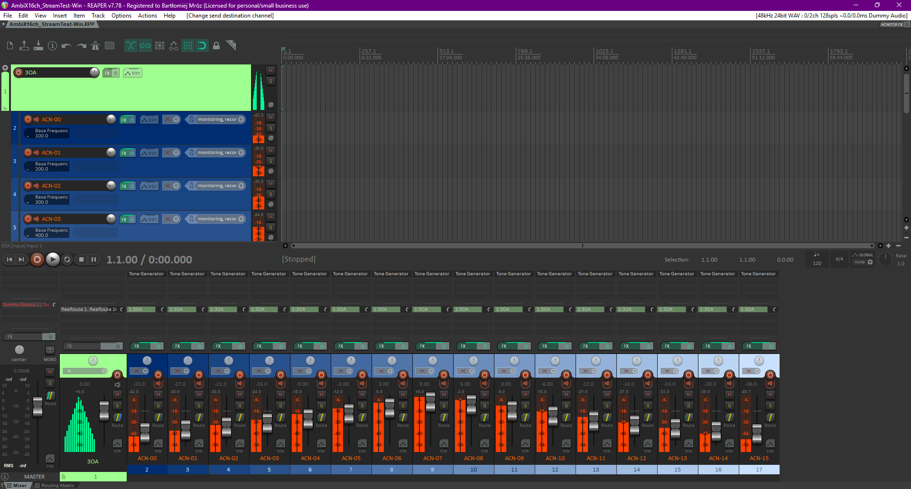
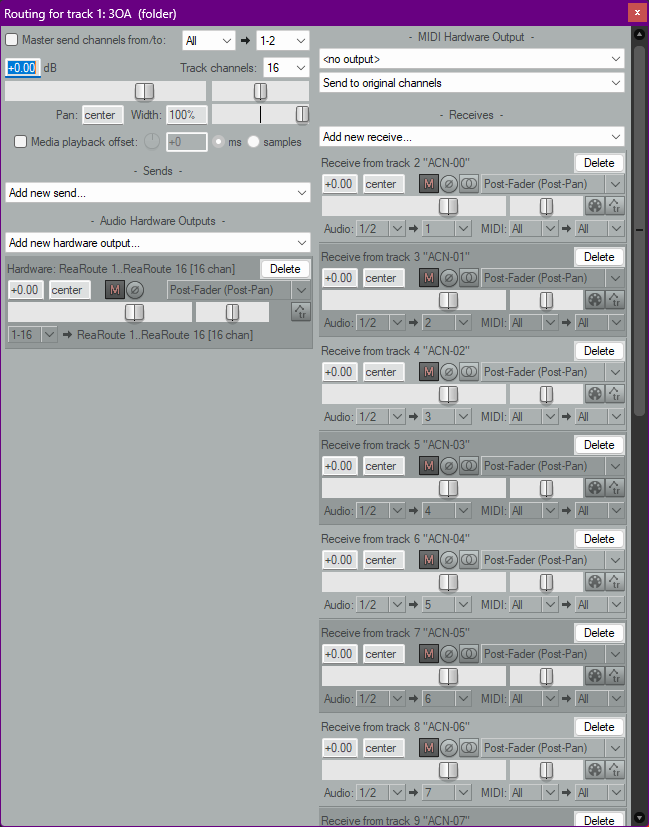
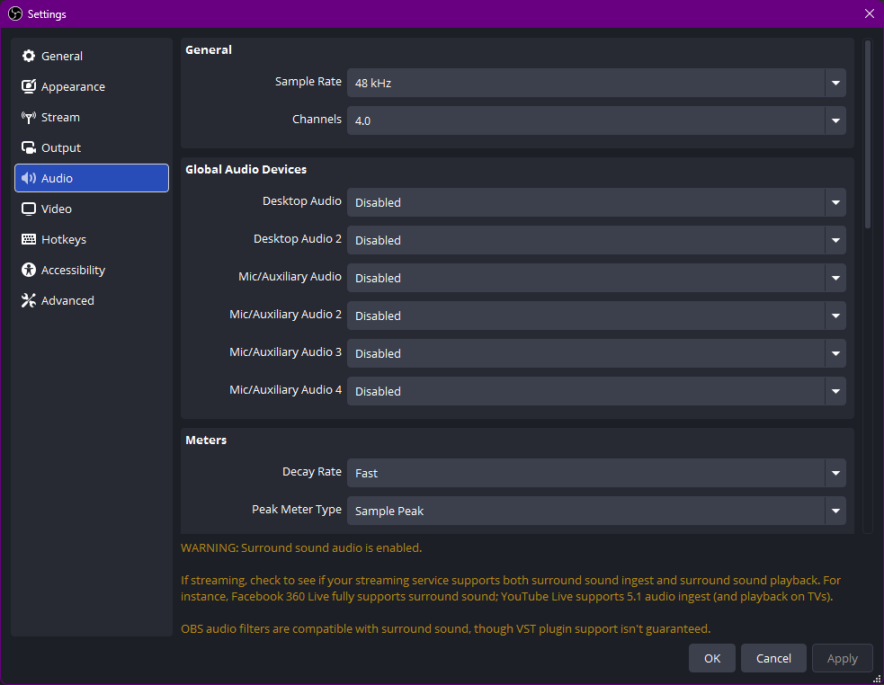
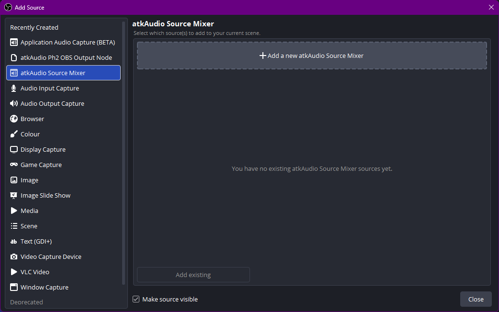
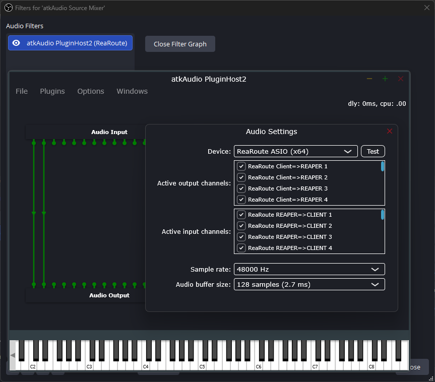
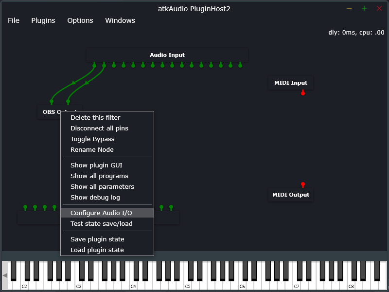
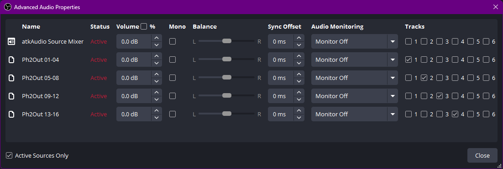

# Stock OBS on Windows: 16 channels over SRT

Everything here was established by pushing a per-channel tone ladder through real hardware and reading back what arrived. Where a setting looks arbitrary, it is not: the obvious-looking alternative fails silently, and the note says how.

Verified on [OBS Studio](https://obsproject.com/) 32.2.1 and [REAPER](https://www.reaper.fm/) 7.78 with ReaRoute, Windows 11.

The steps run in the same order as [the macOS guide](obs-macos.md). Only steps 1 and 3 differ, because Windows has no BlackHole, so the route is ASIO.

## What you need

- **[OBS Studio](https://obsproject.com/) 31.1.1 or newer** (stock - no patched fork).
- **[atkAudio plugin](https://obsproject.com/forum/resources/atkaudio-plugin.2099/)** ([releases](https://github.com/atkAudio/PluginForObsRelease/releases/latest)). OBS has no native ASIO input, and `obs-asio` is abandoned with an open ReaRoute distortion bug on OBS 30+; atkAudio is its named successor. (OBS 33.0 is expected to bring a native ASIO host, which would make this plugin unnecessary.)
- **An ASIO source of 16 channels.** [REAPER](https://www.reaper.fm/)'s **ReaRoute** is the convenient one - it ships with REAPER and appears as an ASIO device to other applications, and the fixture project below is a REAPER project.

**You can import most of this instead of typing it.** The OBS side ships as two presets: a **profile** ([`docs/fixtures/obs-windows-profile/`](fixtures/)), which carries the channel count and the whole Recording tab, and a **scene collection** ([`docs/fixtures/obs-windows-atkaudio.json`](fixtures/)), which carries the four sources and their track assignments. Import them from OBS's **Profile > Import** and **Scene Collection > Import** menus and steps 2 to 5 are done bar the URL, which you still have to point at your own box. The steps are written out anyway, because it is worth knowing what the preset did and where to look when it does not work.

## 1. Send 16 channels into ReaRoute

**REAPER's own audio device is irrelevant here.** ReaRoute is a hardware-output target, not a device REAPER has to be running on, so whatever sits in Preferences > Audio > Device can stay as it is - the captures below were made with REAPER on **Dummy Audio** and no sound card involved at all. This is the one real simplification Windows has over macOS, where the multichannel device does have to be selected.

To test the chain rather than your own content, open [`docs/fixtures/AmbiX16ch_StreamTest-Win.RPP`](fixtures/): sixteen mono tracks, `ACN-00` to `ACN-15`, each carrying one tone of a 100-1600 Hz ladder at its own level, already routed. One tone per channel is what makes channel order and channel loss *visible* rather than a matter of opinion, and it needs only a stock REAPER JS plugin.

<div align="center"></div>

**The routing is two layers.** Each mono track feeds a single 16-channel bus (`3OA`) through an internal send, one send per destination channel: `ACN-00` into channel 1, on up to `ACN-15` into channel 16. Only that bus carries a **hardware output**, mapped `1-16 -> ReaRoute 1..16`, and its **Master send is unticked** so the ladder never reaches your monitors.

Sixteen individual hardware outputs would work too. The bus is worth the extra track because it puts the entire channel mapping in one dialog you can read at a glance - and it is where an ambisonic encoder would sit if you were producing content rather than testing.

<div align="center"></div>

**Record-arm the tracks.** REAPER's audio engine otherwise goes quiet once another application takes focus, which is exactly what happens the moment you click into OBS - the meters there fall silent and it looks like the routing is broken. Arming keeps the engine running in the background so the tones keep flowing while you work in OBS.

**What the fixture is not.** It feeds each ACN channel a bare tone, so nothing in it is *panned*: it is a test signal, not a mix. Real material goes through an ambisonic encoder first - a panner takes a mono or stereo source and a direction, and computes the ACN/SN3D components that place it there, which is what the 16 channels then carry (the [IEM Plug-in Suite](https://git.iem.at/audioplugins/IEMPluginSuite) is the usual free choice). The tone ladder deliberately skips that step, because a signal that has been panned is spread across many channels at once and tells you nothing about which channel went where. One tone per channel is what makes an off-by-one or a dropped channel visible.

## 2. Set the global channel layout in OBS

**Settings > Audio > Channels: `4.0`**

Not 7.1. This governs the channel *width* of every track in the output regardless of how many channels a source actually carries, and it is a **separate gate** from anything configured in atkAudio. Left at 7.1 every 4-channel track is widened to 8 and the recording reads back as 32 channels instead of 16, with nothing to warn you - that one was caught on Windows only because the verification step counts channels. A 7.1 layout also carries an LFE slot that OBS mutes outright: channel 4 of every track arrives digital-silent, measured at -99 dBFS on a real macOS capture, which for ambisonics erases ACN 3, the X axis. Exactly where a 4-channel source lands inside a 7.1 track was never measured, so treat a 7.1 capture as unusable rather than as padding you can strip. Set it before you build anything else, so nothing downstream is measured against the wrong width.

**Channels is the only field on that page that matters.** Every global audio device dropdown can stay **Disabled** - your 16 channels arrive as *sources*, not as global devices.

<div align="center"></div>

OBS then warns that surround sound is enabled and lists which streaming services cope with it. That warning is aimed at people sending 5.1 to a video platform; here the four channels never reach a service that has an opinion about them, so it can be ignored.

While you are in Settings, two fields under **Advanced > Video** are worth setting, and they turn out to be the same story.

**Color Range: Limited**, not Full. This project's rule is limited range throughout - full-range video broke the dash.js/MSE player with `PIPELINE_ERROR_DECODE` (see the [README's troubleshooting table](../README.md#troubleshooting)) - and under the passthrough video path OBS's H.264 reaches the player untouched, so OBS is the first place in the chain that can set it wrong. That was measured on VP9 rather than H.264, but limited range costs nothing either way.

**Color Format: NV12**, the 8-bit 4:2:0 layout H.264 encoders consume natively, so nothing has to convert each frame. This one is a precaution rather than a measurement here: it comes from [obs-studio issue #8226](https://github.com/obsproject/obs-studio/issues/8226), a Windows report of heavy frame drops on the Custom Output (FFmpeg) path that switching to NV12 cured, closed as not planned. Read that report alongside the paragraph above, though - having fixed the drops, the reporter complained that NV12 gave "horribly burned/washed out colors", which is the signature of a range mismatch rather than anything NV12 did. Setting the range explicitly is what keeps you out of that second problem.

## 3. Bring the 16 channels into OBS

atkAudio's real interface is a node-graph editor in its own floating window, not an OBS Properties dialog. The Source Mixer you add below does have OBS properties of its own - a layout selector, source slots, gain sliders and a couple of toggles - but none of them are what carries the 16 channels here, so leave them at their defaults.

atkAudio is the one thing here you have to install; its [plugin page](https://obsproject.com/forum/resources/atkaudio-plugin.2099/) and [latest release](https://github.com/atkAudio/PluginForObsRelease/releases/latest) are linked under [What you need](#what-you-need) above.

Steps 3d and 3e below are the fiddly ones, and they can be skipped: once the PluginHost2 window is open, load [`docs/fixtures/ReaRoute16ch-atkAudioPluginHost2.filtergraph`](fixtures/) into it and the wiring and the Discrete #4 layouts arrive already done. Confirm the device and sample rate afterwards under Options > Change Device Settings.

### 3a. Add the atkAudio Source Mixer source

**Add Source > atkAudio Source Mixer.** Here it exists only to host a filter, so leave its properties as they come. In particular do **not** reach for its combine-sources feature to merge channels: it is capped at stereo and it sums rather than preserving channels, which would destroy the ambisonic field.

<div align="center"></div>

### 3b. Open PluginHost2, the real interface

Right-click that source > **Filters > + > atkAudio Plugin Host2**. A separate floating **atkAudio PluginHost2** window opens. That is the real interface.

<div align="center"></div>

### 3c. Point PluginHost2 at ReaRoute ASIO

In that window: **Options > Change Device Settings**. Set Device to **ReaRoute ASIO**, sample rate to match your REAPER project (48000 Hz), and make sure all 16 channels are ticked under **Active INPUT channels** ("ReaRoute REAPER=>CLIENT" - audio coming *from* REAPER). They are generally all ticked already, but check them through anyway: a single missing one costs you an ambisonic channel and nothing later will say so. The Active OUTPUT list can be left alone; that direction sends OBS audio back to REAPER and is not used here.

<div align="center"></div>

### 3d. Create four OBS Output nodes

**Plugins > Create Plug-in > OBS Output**, four times - one instance per group of four channels. Wire Audio Input ports 1-4 into the first, 5-8 into the second, 9-12 into the third, 13-16 into the fourth. Order matters: this is what preserves AmbiX channel order.

New plug-ins land at a **random spot on the canvas**, and sometimes that spot is unreachable - the node exists but you cannot scroll to it or drag it back into view. There is no way to recover a single stranded node: **Plugins > Delete all Plug-ins** and build the graph again. That clears every node, Audio Input included, and none of them return on their own. Recreate Audio Input from the same Plugins > Create Plug-in menu; Audio Output and the MIDI nodes can be put back the same way if you want them, though nothing in this recipe uses them.

<div align="center"></div>

### 3e. Set each node to Discrete #4

**Each OBS Output node defaults to stereo.** Right-click the **node itself** (not a port, and not its OBS Properties dialog) > **Configure Audio I/O**, and set the **Input Configuration**'s Channel Layout to **Discrete #4**. Repeat for all four nodes - each one left at stereo costs two channels, so missing a single node gives 14 rather than 16, which is easy not to notice. Leave the Output Configuration alone: the dialog draws one, but compare the halves in the screenshot below - Input Configuration has a numbered bus, Output Configuration has only the + and - buttons with no bus beneath them. The node declares an input bus and no output bus (`ObsOutput.h` in the plugin's AGPL source constructs with `withInput("Input", AudioChannelSet::stereo(), true)` and contains no `withOutput`), and the channel count OBS sees is that input bus width.

Use "Discrete" rather than one of the named layouts alongside it. That was a precaution, not a measurement: a named 4-channel layout asserts what its channels *mean* and could imply an ordering or an LFE slot with nothing to do with ACN 0-3, whereas discrete channels carry no such claim. The dropdown offers `Quadraphonic` and, further down, genuine ambisonic sets - JUCE carries channel sets up to high orders. None of them were tested here, and it very likely makes no difference: the plugin hands OBS only the channel *count*, so any 4-channel choice arrives as the same thing.

This step is undocumented upstream: a search of the plugin's forum thread, its whole changelog, its reviews and every GitHub issue turned up no mention of it. Skip it and every node stays stereo, which cannot reach 16 - OBS offers six audio tracks, so 2-channel nodes top out at 12 channels no matter how many you create. The plug-in itself does not appear to cap how many OBS Output nodes you can add; the ceiling is OBS's track count times the per-track width, which is why the width is the thing to fix.

<div align="center">
  
  
</div>

The finished graph looks like this - one Audio Input node fanning out to four OBS Output nodes, four connections each:

<div align="center"></div>

Four sources now appear in the OBS **Sources** panel, with real level meters. They have no Properties dialog of their own, which is expected - everything about them lives in the graph. Rename each one to carry its channel range - `Ph2Out 01-04`, `Ph2Out 05-08`, `Ph2Out 09-12`, `Ph2Out 13-16`. Nothing downstream reads the names, but the next step asks you to match each source to a track number, and generic names make that easy to get wrong.

<div align="center"></div>

## 4. Assign one source per track

**Advanced Audio Properties** (right-click any source in the Audio Mixer): assign `Ph2Out 01-04` to Track 1, `05-08` to Track 2, `09-12` to Track 3, `13-16` to Track 4. Tick exactly one track per source and untick the rest.

<div align="center"></div>

The join downstream is strictly positional - track 1 becomes channels 1-4, track 2 becomes 5-8, and so on, never a downmix - so AmbiX order survives end to end provided the mapping above is exact.

## 5. Point OBS at the box

**Settings > Output > Output Mode: `Advanced`**, then the **Recording** tab:

| Setting | Value |
|---|---|
| Type | **Custom Output (FFmpeg)** |
| FFmpeg Output Type | **Output to URL** |
| File path or URL | `srt://<host>:8890?streamid=<your-name>&latency=2000000&pkt_size=1128` |
| Container Format | **mpegts** |
| Audio Encoder | plain **`aac`** - tick **"Show all codecs"** if it is hidden |
| Audio Track | tick **1, 2, 3, 4** |
| Video Encoder | any H.264 encoder; keyframe interval 2 s, CFR |
| Bitrates | see [Bitrate](../README.md#bitrate) - audio 384 kbit/s per track, video against your uplink |

<div align="center">:8890?streamid=<name>&latency=2000000&pkt_size=1128, mpegts, 6000 Kbps, keyframe interval 60, libx264, 384 Kbps audio, tracks 1 to 4, aac."></div>

<p align="center"><em>The URL carries both parameters that matter: <code>&amp;latency=2000000</code>, since SRT's default of about 120 ms survives loopback and little else, and <code>&amp;pkt_size=1128</code>, for the reason in <a href="#5-point-obs-at-the-box">the tunnel trap below</a>. Substitute your own host and stream name for the two placeholders.</em></p>

The screenshot shows **`libx264`**, the software encoder, which is present on every machine. With an NVIDIA card, `h264_nvenc` moves the work onto the GPU and is worth picking if you have one. AMD and Intel have equivalents in the same dropdown (`h264_amf`, `h264_qsv`) when the hardware and drivers are there, though neither was tested here. Whichever you choose, keep the keyframe interval at 60 frames - 2 s at 30 fps - because that is what the segment duration downstream is aligned to.

Three traps in that table, all silent:

- **`latency` is in MICROSECONDS.** 2 s is `2000000`. Writing `2000` asks for 2 ms and the stream will not survive the smallest amount of loss.
- **Through a tunnel, cap the packet size.** SRT's default packet is about 1316 bytes, but a WireGuard or Tailscale tunnel carries a 1280-byte MTU, so every packet fragments - and under load a large share of the fragments never reassemble, so the picture arrives shredded (blocky green and magenta, the player aborting with a decode error) while SRT still reports the link up. Add `&pkt_size=1128` (six 188-byte transport packets, which fits) to the URL; it is harmless on an ordinary 1500-byte path and essential on a tunnelled one.
- **The default audio encoder is `mp2`, which flatly refuses more than 2 channels.** You get "Failed to open audio codec: Invalid argument" and nothing else.

Leave **Muxer Settings** empty; PID remapping is cosmetic for an ffmpeg receiver.

## 6. Push it

Press **Start Recording**.

That is not a typo. Custom Output (FFmpeg) is a *recording* output in OBS even when its destination is a URL, so it lives on the Recording tab and Start Recording is what pushes it. Start Streaming does nothing for it.

The stream appears on the player page within a few seconds of the first keyframe.

Custom Output (FFmpeg) does **not** auto-reconnect. If the connection drops you have to press Start again; the guest endpoint holds your slot for a grace window (default 120 s) so a prompt reconnect continues the same session.

## If it does not work

| Symptom | Cause |
|---|---|
| "Failed to open audio codec: Invalid argument" | Audio encoder is still `mp2`. Tick "Show all codecs" and pick plain `aac`. |
| Connects, but the player shows nothing and the session auto-ends after ~45 s | The stream is not four 4-channel tracks. Check Settings > Audio > Channels is `4.0` and that all four tracks are ticked in the output. |
| Audio arrives but the ambisonic field is wrong | Channel order. Verify with a tone ladder (below) before blaming the renderer. |
| Recording reads back as 32 channels, not 16 | Global Settings > Audio > Channels is `7.1`, not `4.0`. |
| No ASIO option anywhere in OBS | atkAudio is not installed, or OBS is older than 31.1.1. |
| A `Ph2Out ...` source has no Properties at all | Expected. Those sources are configured entirely in the PluginHost2 graph window; only the Source Mixer has OBS properties, and none of them matter here. |
| Stuck at 2 channels per track, so 12 channels at most | The OBS Output nodes are still stereo. Right-click each node > Configure Audio I/O, and set the Input Configuration to Discrete #4. |

## Proving the channel order

Do not trust the chain by ear. Play the tone-ladder project from [step 1](#1-send-16-channels-into-rearoute), record locally, and check what came back:

```bash
./scripts/merge-obs-tracks.sh --check recording.mkv     # expect: 4 track(s), channels per track: 4 4 4 4
./scripts/merge-obs-tracks.sh recording.mkv merged.mov --channels 16
ffmpeg -v error -ss 5 -i merged.mov -map 0:a:0 -t 1.5 -f s16le -c:a pcm_s16le - \
  | python3 scripts/check-tones.py 16 48000 100 100
```

The last two arguments are the ladder's base frequency and step, so adjust them to whatever tones you generated. `check-tones.py` asserts channel *k* carries tone *k* and fails a channel that is silent, so a scramble and a muted channel are both caught rather than guessed at. `scripts/test-srt-ingest.sh` runs the same assertion through the live SRT path end to end.

Two Windows-specific notes on running those commands: if both WSL and Git Bash are installed, plain `bash` may resolve to WSL, which mounts Windows drives at `/mnt/c/...` where Git Bash uses `/c/...` - check the shell prompt before assuming a path. And a Windows clone of this repo may check the scripts out with CRLF line endings, which breaks the `#!/usr/bin/env bash` shebang with an opaque `bash\r: No such file or directory`; the repo now ships a `.gitattributes` forcing LF, so a fresh clone is fine.

## See also

- [obs-macos.md](obs-macos.md) - the same recipe on macOS, where the audio routing is simpler
- the [main README](../README.md) for the RTMP path and the guest endpoint's session rules
