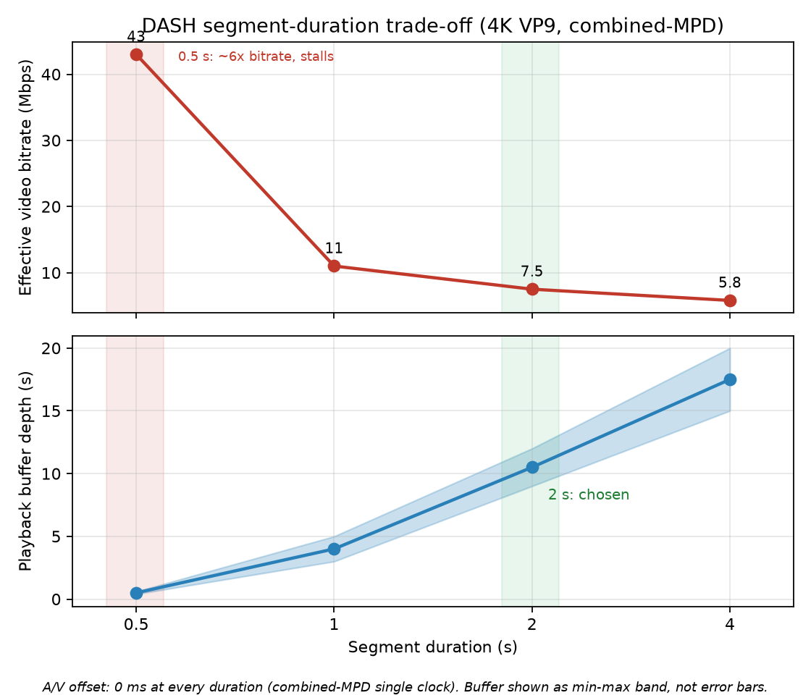

# Phase 5 - lip-sync / segment-duration measurement results

**Date:** 2026-06-12 (color-range fix 2026-06-13) · **Host:** the encode host (WSL2, 32 cores)
· **Master:** `content/demo_4k.webm` (VP9 3840x1920 @ 29.97 fps, 16-ch Opus, 95 min)
· **Decision: 2 s segments.**

## Method

1. A 90 s excerpt (calm 0-17 s + high-bitrate section past 17 s) was re-encoded
   four times from the master with identical settings except GOP, per the
   GOP-per-segment rule at 29.97 fps: `-g 15 / 30 / 60 / 120` for 0.5 / 1 / 2 / 4 s
   segments. All four also carry a uniform full->limited range conversion
   (`-vf scale=in_range=pc:out_range=tv -color_range tv`) so the bitstream
   matches the live pipeline and survives hardware decode (see Caveats). Audio
   was **stream-copied**, so audio timestamps are bit-identical across variants
   - video GOP is the only variable between variants.
2. Each variant was packaged from its GOP-matched master with
   `scripts/package-dash-variants.sh <master> <duration>` (Shaka Packager
   v3.7.2, discrete segments + static SegmentTemplate MPD - same structure
   as the live stack - 16 channels preserved).
3. Static analysis: ffprobe start/first-pts of the packaged `video.webm` /
   `audio.webm` per variant, plus MPD inspection.
4. Dynamic analysis: `scripts/measure-lipsync.js` - headless Chromium, fresh
   page per variant, 20 s sampled playback: clocks, stalls, dropped frames,
   dash.js per-track buffer levels. Three runs.

## Results

### A/V offset (the actual lip-sync question)

| Variant | baked-in A-V start offset | audio PTO (Opus pre-skip) | A/V drift over 20 s |
|---|---|---|---|
| 0.5 s | 0.000 ms | 7 ms (uniform) | none |
| 1 s   | 0.000 ms | 7 ms (uniform) | none |
| 2 s   | 0.000 ms | 7 ms (uniform) | none |
| 4 s   | 0.000 ms | 7 ms (uniform) | none |

**Segment duration does not measurably affect A/V sync** in the combined-MPD
path: audio and video share one media element clock under MSE, Shaka preserved
timestamps exactly (0.000 ms start offset everywhere), and the only nonzero
timing term - `presentationTimeOffset="7000"` (7 ms, timescale 10^6) on audio -
is the standard Opus codec-delay compensation, identical in all variants.
Per-track buffer fill stayed bounded (audio <= ~2 s ahead of video, no growth),
i.e. fill granularity, not drift.

### Side effects of segment duration (what actually differs)

| Variant | 90 s package size | effective video bitrate | stalls (typ.) | mean video buffer |
|---|---|---|---|---|
| 0.5 s | 465 MB | ~43 Mbps | 2-4 | 0.4-0.6 s |
| 1 s   | 125 MB | ~11 Mbps | 1 | 3-5 s |
| 2 s   |  87 MB | ~7.5 Mbps | 1 | 9-12 s |
| 4 s   |  69 MB | ~5.8 Mbps | 1 | 15-20 s |

*Bitrate and buffer depth vs segment duration (`scripts/plot-segment-tradeoff.py`;
PNG + SVG). Buffer is a min-max band, not error bars; A/V offset is a structural
0 ms at every duration, so it is noted rather than plotted.*

- **0.5 s is not viable at 4K**: a keyframe every 15 frames forces libvpx far
  past the 4 Mbps target (~6x bitrate at its quality floor), and the playback
  buffer hovers under 1 s - it was the only variant with repeated stalls.
- 1 s / 2 s / 4 s are equivalent on sync; they differ only in bitrate overhead
  and buffer depth. Startup latency was ~0.4-0.6 s for all variants.
- Playback-ratio numbers below 1.0 in some runs are **headless software-decode
  throttling** (57-60 % dropped frames in *every* variant on this box), not a
  variant property.

## Decision: 2 s

- Sync is a wash, so the live-pipeline constraints decide.
- 2 s matches the live stack as deployed (`-g 60 -keyint_min 60
  -seg_duration 2` at 29.97/30 fps) and the ffmpeg DASH muxer's verified
  behaviour (uniform 2.002 s segments).
- With `liveDelay = 30 s` the player sits 15 segments behind the edge - ample
  cushion; 1 s segments would double manifest/request churn for no sync gain,
  4 s would halve the timeShiftBuffer granularity and slow startup-to-seek
  precision without benefit.
- 0.5 s ruled out (bitrate floor + buffer starvation, above).

## Caveats / repro

- Shaka's WebM parser rejects ffmpeg multi-track muxing ("block with a
  timecode before the previous block"); `package-dash-variants.sh` now splits
  the master into single-track inputs automatically.
- Do NOT package with the on-demand profile (`output=` single file):
  SegmentBase byte-range addressing needs a Range-capable server, and the
  documented `python3 -m http.server` ignores Range headers (200 + full file),
  crashing dash.js's WebM Cues parser with "required tag not found".
  The script now emits discrete segments (`segment_template=` +
  `--generate_static_live_mpd`), which any static file server can serve;
  `scripts/measure-lipsync.js` deliberately serves with python3 to keep this
  regression covered.
- **Full-range VP9 breaks the dash.js/MSE playback path.** The first excerpt
  masters inherited `color_range=pc` (full range) from `demo_4k.webm`. They
  played in the headless harness (0 errors) but a real GPU browser threw
  `PIPELINE_ERROR_DECODE` / `CODE:3 MEDIA_ERR_DECODE` on a loop - dash.js kept
  resetting the MediaSource and never advanced. The audio is byte-identical
  across the pc and tv packagings (stream-copied, OpusHead 48 kHz both), so the
  video range flag is the sole differentiator - the fix is proven by that
  controlled difference. The live earshot pipeline emits limited-range (tv) VP9,
  so the masters were wrong, not the player. Fixed by re-encoding with a range
  conversion (`-vf scale=in_range=pc:out_range=tv -color_range tv`); the MPD
  codec string changed `vp09....01.01` -> `vp09....01.00` (trailing `.00` =
  limited-range flag), and `package-dash-variants.sh` now hard-fails on a
  pc-range source.
  - Diagnosis caveat: this is specific to the MSE/dash.js path. `chrome://media-internals`
    showed `D3D11VideoDecoder` decoding the *same* full-range bitstream fine in
    plain single-file playback - so "just open the .webm directly" does NOT
    reproduce it (and a bare `<video>` of the 16-ch master can fail for an
    unrelated reason: an audio-renderer config-change at a video keyframe). The
    headless software path can't see it either. Trust the packaged-variant test
    in the real player, not shortcuts.
- Human verification (by ear/eye, clap transient) on a GPU browser is still
  worthwhile: serve this folder (`python3 -m http.server 9000`) and use the
  tabs + snap log. The headless harness cannot judge perceived sync, only
  clocks and packaging. Verified on a real GPU browser (D3D11VideoDecoder,
  hardware): good lip-sync from the start on the `1h06` scene.
- Scene tab (`1h06`): a 90 s excerpt from 1:06:20 of the recording, where a
  sharp transient makes sync judgeable. Reproduce with
  `scripts/make-lipsync-scene.sh` (defaults to 1:06:20 / 90 s / label `1h06`);
  it bakes the tv-range conversion and `-g 60` and packages to
  `lip-sync-test/dash_1h06/`, served by the matching `index.html` tab.
- Residual A/V offset (constant): the picture leads the sound by roughly the
  Web Audio output latency. HOAST360 routes audio
  videoElement -> MediaElementAudioSourceNode -> HRIR convolver -> speakers, so
  the sound trails the frame by about `AudioContext.outputLatency` (tens of ms,
  device-dependent) plus the convolver's small group delay. It is constant, and
  audio-late is the forgiving direction (tolerated to ~125 ms vs ~45 ms for
  audio-early), so at these magnitudes it is below the lip-sync threshold. It
  cannot be cancelled in the combined-MPD path without delaying the video (a
  `<video>` element has no render-delay control; a `DelayNode` would delay the
  audio further, worsening it). The snap button logs `outputLatency` per device
  so the magnitude can be checked before deciding to act.
- Per-GOP excerpt masters kept in `content/lipsync_g{15,30,60,120}.webm`
  (limited range, gitignored) for re-runs; the original full-range encodes are
  preserved alongside as `content/lipsync_g*_pcrange.webm` for reference.
