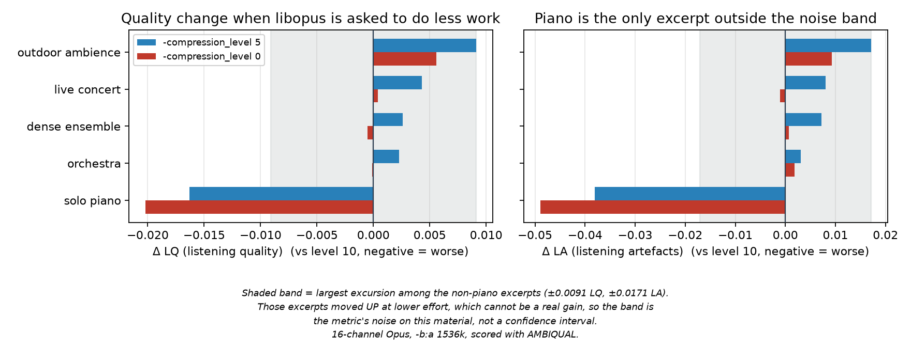

# libopus `-compression_level` on 16-channel ambisonics: measurement results

**Date:** 2026-08-10 · **Host:** MacBook (arm64, macOS) · **Encoder:** `libopus`, `-mapping_family 255`, `-b:a 1536k` (96 kbit/s per channel, the production setting) · **Metric:** [AMBIQUAL](https://github.com/QxLabIreland/Ambiqual) · **Material:** five excerpts (30 s, 20 s for the shortest source) from the [HOA seven-year corpus](https://doi.org/10.5281/zenodo.21789163)

## The question

Nothing in this stack sets `-compression_level`, so every Opus encode runs at libopus's default of **10**, the slowest and most thorough setting. Lowering it toward 5 is a standard way to buy encoder CPU back for a difference that is usually hard to hear, and here it would apply to 16 channels on every route including a Raspberry Pi 4, where the margin is thinnest.

So: what does level 5 actually save, and what does it cost?

## Answer

**Leave it unset.** There is no meaningful CPU to reclaim - the whole saving is 0.9 % of a core - and the one material that shows any degradation is solo piano, the most common content type in the corpus this stack serves.

## Method

1. Five excerpts, 16-channel ACN/SN3D at 48 kHz, chosen to span the ways a codec fails: sparse tonal with long decay (solo piano), broadband many-source (orchestra), dense contemporary ensemble, a live concert with audience, and outdoor ambience with no dominant source. Windows selected by content with [`scripts/pick-excerpt.py`](../scripts/pick-excerpt.py), not by a fixed offset - see the limits below for why that matters.
2. Each excerpt encoded three times with **only `-compression_level` varying** (10, 5, 0), then decoded back to PCM.
3. AMBIQUAL run with the **uncompressed excerpt as reference** in every case, never one encode against another: the question is how much quality a setting gives up, so both settings need the same reference.
4. Encoder cost measured separately as wall-clock to encode the same 30 s.

Harness: [`scripts/measure-opus-compression.sh`](../scripts/measure-opus-compression.sh).

**Why not the tone ladder.** Pure tones are the easiest possible case for a transform codec, near-transparent at any setting, so an A/B on them would have shown nothing and invited the wrong conclusion. The synthetic ladder in `scripts/test-pipeline.sh` stays for wiring checks (channel order, level ramp), which is a different job.

**Why AMBIQUAL and not a binaural metric.** It works in the ambisonic domain, so there is no binaural render in the loop and therefore no HRIR choice and no renderer latency to confound the result.

## Encoder cost

Wall clock to encode 30 s of 16-channel audio, and what that is as a fraction of one core in realtime terms:

| `-compression_level` | encode time | share of one core |
|---|---|---|
| 10 (default) | 1.68 s | 5.6 % |
| 5 | 1.41 s | 4.7 % |
| 0 | 0.76 s | 2.5 % |

**Dropping 10 to 5 saves 0.9 % of a core.** For scale, the 16-channel AAC re-encode that the direct-to-DASH path removed measured **59 %** of a core. The Opus encode is an order of magnitude cheaper than the thing already optimised away, so the premise that this was worth optimising does not survive measurement.

## Quality

AMBIQUAL `LQ` (listening quality) and `LA` (localisation), both 0-1, higher is better. Deltas are against level 10.

| excerpt | character | c5 ΔLQ | c5 ΔLA | c0 ΔLQ | c0 ΔLA |
|---|---|---|---|---|---|
| solo piano | sparse tonal, long decay | **−0.0163** | **−0.0381** | −0.0202 | −0.0489 |
| orchestra | broadband, many sources | +0.0023 | +0.0031 | −0.0001 | +0.0018 |
| dense ensemble | contemporary, wide dynamics | +0.0026 | +0.0072 | −0.0005 | +0.0007 |
| live concert | full band with audience | +0.0043 | +0.0080 | +0.0004 | −0.0011 |
| outdoor ambience | quarry, no dominant source | +0.0091 | +0.0171 | +0.0056 | +0.0093 |

*The band is the metric's own noise on this material, not a confidence interval: it is drawn at the largest excursion among the excerpts that moved **up** when the encoder was asked to do less work, which cannot be a real gain. Piano is the only excerpt that leaves it. Regenerate with `python3 scripts/plot-opus-compression.py 2026-08`.*

**Piano is the only excerpt that degrades, and the effect is real but modest.** Every other item moved *up* at level 5, which cannot be a genuine quality gain from spending less encoder effort. That upward spread is therefore the metric's noise on this material, and it is worth using as a yardstick rather than ignoring: the largest non-piano excursion is +0.0091 LQ and +0.0171 LA. Piano's losses are **1.8x and 2.2x** those figures respectively.

So the honest statement is not "piano measurably degrades" but "piano is the only item that moves in the direction a real effect would, and it moves about twice as far as the noise". That is suggestive, consistent with theory - sparse transient tonal material is exactly where encoder search effort should matter and dense broadband material masks its own artifacts - and short of proof. Five excerpts, one window each, no repeats, no confidence intervals.

**Localisation degrades further than quality**, by 2.3x on piano. That is the specific risk that motivated an ambisonic-domain metric over a plain quality one, and it is the one result here that would be invisible to a mono or stereo measurement.

## Why this closes the question

**The decisive argument is the CPU one, not the quality one.** The trade on offer is 0.9 % of a core. Even if the quality effect were exactly zero, there is nothing here worth changing a default for: the Opus encode is already an order of magnitude cheaper than the AAC re-encode this project removed to reclaim 59 %.

The quality evidence points the same way without having to carry the argument. Piano is the single most common content type in the corpus this stack was built for, 8 of its 23 sessions (the corpus is published separately, [10.5281/zenodo.21789163](https://doi.org/10.5281/zenodo.21789163)), so the one material that plausibly loses is the material that matters most here.

This is not "safe to lower, take the win". There was no win to take.

## Limits, stated plainly

- Five excerpts, one window each, one metric, no listening test and no repeats. Four of the five moved in the impossible direction (better with less encoder effort), which is what the noise-floor reading above is built on; no confidence intervals were computed.
- Measured on arm64 macOS. The CPU fractions will differ on the Pi 4, but the *ratio* between settings is a property of the encoder, and 5.6 % of a core has a long way to fall before it competes with anything else in the pipeline.
- **Choose excerpts by content, not by clock.** A fixed 60 s offset put the live-concert excerpt squarely in the pre-concert audience (spectral flatness 0.33 at −49 dBFS) and left the ambience one 66 % near-silent. Both were re-cut with [`scripts/pick-excerpt.py`](../scripts/pick-excerpt.py), which scores sliding windows on level, spectral flatness and steadiness; the concert moved from −49.5 dBFS / flatness 0.33 to −18.4 / 0.083. Selection is part of the method, not a detail, and the first pass got it wrong.
- **AMBIQUAL as published does not run.** `calculate_ambiqual` references `n_channels`, which no longer exists after a rename to `n_channels_ref`/`n_channels_deg`, so it raises `NameError` on the first channel. Patched locally to `min(n_channels_ref, n_channels_deg)`, which is what the downstream NaN handling already assumes: same count means nothing was lost (fill 1.0), ref-HOA against deg-FOA means channels were lost (fill 0.1). Its pinned `numpy==1.23.5` also has no wheel for current Python; `numpy>=1.26,<2` works and stays on the 1.x API the code predates.
- The source audio is not in this repository. The corpus is published separately ([10.5281/zenodo.21789163](https://doi.org/10.5281/zenodo.21789163)); point the harness at any 16-channel ACN/SN3D material to reproduce the shape of the result.
